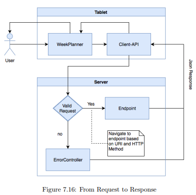
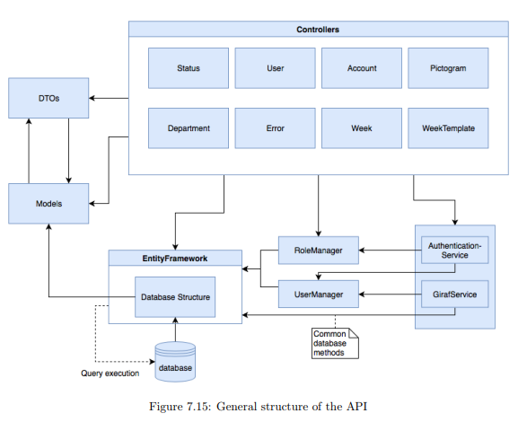

# Web-API purpose

## What is a [Web API](https://en.wikipedia.org/wiki/Web_API)?

A Web API is an application programming interface located on a web-server. It manages the retrieval of requests as well as passing along an associated responses through the HTTP/HTTPS protocol. Such requests are usually in the format of JavaScript Object Notation (Json) or Extensible Markup Language (XML).

## Why the repository exists and whats its used for?

The web-API repository is the backend of the [Giraf Project](https://github.com/aau-giraf/web-api), and it is built with the .NET Core in C#. More specifically the Web API is responsible for the handling of all communication coming from and to the API-Client as shown Figure 7.16. If it is a valid request this leads to an [endpoint](./EndpointsAndControllers.md) and if not then an error response is returned. Most request would require the web-API to communicate with the [database](./Database.md) that stores all the data related to the Giraf Project, which allows several of components to be communicating information to the common database.



## Endpoints and Controllers

An endpoint is one end of a communication channel, used to interact with other systems and which usually exposes a set of operations related to a common domain, such as a user or account. When an API interacts with another system, the touchpoints of such communication is called endpoint. An API works by receiving requests and returning appropriate responses. Each endpoint of the web-API is represented by a controller, for which each request is routed to the appropriate controller, e.g. a request for the user endpoint, denoted by the route ```v1/UserController```, would be handled by the UserController. The response returned by the endpoint are mitigated by the appropriate Controller. The current Controllers of the project are: 

- AccountController
- ActivityController
- UserController
- DepartmentController
- PictogramController
- WeekController
- WeekTemplateController
- StatusController
- ErrorController



# Related Artifacts

## web-api-dotnetcore-build
Is a Docker containers for the development branch of the webAPI.

## api_client
The api_client is an api that communicates with the web-API. The Giraf project spans several applications, and where each may be required to communicate with the web-API. To alleviate the requirement of implementing communication with the Giraf backend in several applications, the web-API, a common api-client project has been initiated. Formally it is a Dart package that can be used to implement communication with the web-api in any front-end framework Flutter project, which is currently useful for the WeekPlanner project, that is implemented in Flutter.

## Next

The full [Backend Architecture](./BackendArchitecture.md).