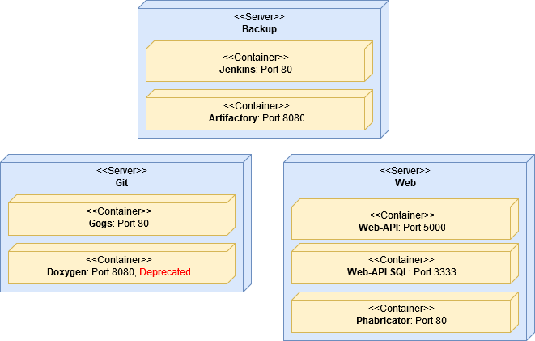

# Server Overview

In this article we describe what servers there are, what they are running and how to access them.

There are five servers available, all running CentOS 7.  Legacy services on the web, git and backup servers.
First row in the table below shows the server and the rows below the server shows which services it runs.

|web|git|backup|
|---|---|---|
| Phabricator | Gogs | Jenkins|
| MySQL | | Artifactory |
| REST API | | |

An illustration of the current server architecture can be seen in the figure below: 

Keep in mind, this is a simplification. The reason Jenkins and Artifactory runs on the backup server is because we needed to use the old server they ran on for setting up node00.

The services on these servers has to be deployed in the [Kubernetes Cluster](./kubernetes.md)  at some point.
Right now the Kubernetes cluster consists of two servers, but we only have one service running in our cluster which is Artifactory.
Then we also have network file system (nfs) running on the master00 server, but not inside the cluster, as we needed some persistent storage.

| master00 | node00 |
|---|---|---|
| nfs | Artifactory |

Then to understand Kubernetes, read the [Kubernetes](./kubernetes.md) section.

## Accessing the Server

To access the server you need to know how to use SSH with private and public keys. We recommend using SSH on Linux or macOS as these two are the easiest to use it from.
We have given you a private key you can use to log in on any of the servers, the user you log in on has root access.

web: web.giraf.cs.aau.dk  
backup:  backup01.giraf.cs.aau.dk  
master00: master.giraf.cs.aau.dk  

Notice that the node00 doesn't have a domain, this is because it's a node in the Kubernetes cluster, so it's not meant to be accessed directly. It can be controlled from master00.

## Web-API Docker container ports

|  | port |
|---|---|
| Production                | 5000 |
| Development            | 5050 |
| Current release          | 5100 |
| Release number two  | 5150*|
*not currently oppened

## READ: After logging in on the server the first time, you should create a new user and generate a key pair for it!

Another way to access the servers are through VSphere which you can access [here](http://www.its.aau.dk/vejledninger/VMware/web-client/). VSphere is what you want to use when you redeploy the CentOS 7 installation on the servers.

## NOTICE: Network access workaround

ITS has made a routing problem, which means either you can access our servers from outside or inside the network using the domains. You cannot do both because of their routing problem. We wrote a Python script as a workaround for this and it can be found [here](http://git.giraf.cs.aau.dk/Giraf-Tools/scripts/src/master/ip_routing.py). Run this script on all the servers you wish to access through their domains from outside and inside the AAU network.

## Server Administration Git Organization 

We made a git organization to serve as a collection for all the configuration files we used to set up the servers. This git organization can be found [[http://git.giraf.cs.aau.dk/Giraf-Tools | here]]. There are four git repositories in the organization. These repositories are for kickstart, docker, kubernetes and scripts. In the table you can see what these repositories contain more specifically.

| [[guides/server/kubernetes | Kubernetes]] | Kubernetes manifest files to deploy applications on our cluster | [[http://git.giraf.cs.aau.dk/Giraf-Tools/kubernetes-files | link]] |
| scripts | A random collection of scripts, currently there is only a script for setting up [[https://github.com/kubernetes/minikube | minikube]] on Fedora and Ubuntu and a script for fixing the routing error made by ITS | [[http://git.giraf.cs.aau.dk/Giraf-Tools/scripts | link]] |

## Backup System 

We use the backup server for doing storing backups, but the backup server doesn't collect the backup data itself, it's the other servers that creates their backups and put it on the backup server. It makes sense from the view that if the backup server is compromised, the other servers won't be compromised as it cannot access them. It also means if any other server is compromised, only the backup server can also be compromised. To do the backups, there is used a [[https://en.wikipedia.org/wiki/Cron | Cron job] to run a backup script on all the servers. To find the backup script you can check the [[https://help.ubuntu.com/community/CronHowto | Cron tab]].

When changing the Git repository manager from Gogs to Gitlab in 2018, many of the outdated repositories were not included. Instead, they were zipped, and put on the backup server, under the directory /root/zipped-repos .