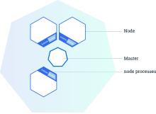
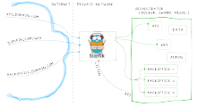
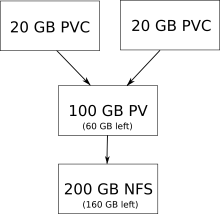

# Kubernetes

In this article we describe what Kubernetes is, how it works and how to
use it. First we describe the basic principles of getting a minimum
usable Kubernetes infrastructure, with services, up and running.
Afterwards we describe the advanced principles of accessing Kubernetes
externally, setting up persistent storage, storing secrets securely and
setting up certificates.

The official Kubernetes documentation defines Kubernetes in the
following way: "Kubernetes is an open-source platform for automating
deployment, scaling, and operations of application containers across
clusters of hosts, providing container-centric infrastructure"

#### Basic Principles

In this section we describe how to set up a minimum usable Kubernetes
infrastructure. In this context a minimum usable Kubernetes
infrastructure means that it can run our applications, but doesn't
necessarily support making the applications available externally.

To give a better understanding of Kubernetes we have an explanation of
some of its basic concepts. We start by introducing the concepts from
top to bottom, which means explaining what a Kubernetes cluster is, then
explain what a cluster depends on and what the cluster's dependencies
depend on. Physical (hardware) manifestation of Kubernetes setup will be
explained from the three following
concepts.

* Cluster: A group of physical and/or virtual machines. A cluster contains at least one master and zero or more node servers. In the picture, an example of a cluster with a single master and three nodes is shown.
* Master: A server which manages the nodes running in the cluster. There can be multiple master servers in a cluster, which can give better performance for huge clusters and better uptime. The reason this gives better performance is that each master server can concentrate on managing one part of a larger system. The reason it gives better uptime is because configuration files are also distributed between all master servers, so if one master server goes down, all the other master servers can take over for it. 
* Node: A server which runs and manages the actual applications. It can be controlled by a master server through the kubelet service.



Now we need to understand the system services that run on master and
node servers. While some of these are part of Kubernetes, they are not
Kubernetes services, which is a separate type of abstraction over pods
to make them accessible.

The following system services run on
master:

* API-server: System service that validates and configures request to alter the state of the cluster. It provides a web API server to perform the requests. Part of Kubernetes.
* Scheduler: System service that schedules how workloads should be distributed between nodes. Part of Kubernetes.
* Controller Manager: System service that attempts to change the current cluster state towards the desired state. It runs the loop for various controllers, that control various areas of the cluster. Part of Kubernetes.  
* Etcd: System service that provides a configuration store that can be distributed between multiple servers. Kubernetes stores its configuration in etcd. Third party program.
* Flannel: System service that provides a overlay network for communication between containers on different nodes. Flannel also uses etcd to store its configuration. Third party program.

The following system services run on
node:

* Flannel: System service that is setup to connect to a Flannel network. It fetches its network configuration from etcd. Third party program. 
* Kubelet: System service that is responsible for the communication between masters and nodes. It ensures the appropriate containers are started and remain healthy. Part of Kubernetes.
* Proxy: System service that provides a network proxy and load balancer for services on a node. Part of Kubernetes.

As the Kubernetes cluster is a network of servers, it's important to
understand the usage of different IP-addresses and subnets. Subnets are
to divide IP-addresses into networks, so that a specific range of
IP-addresses are allocated within the network. A subnet can be formally
defined using the cidr notation. An example of cidr notation is
192.168.0.0/16, which refers to the subnet with IP-addresses that range
from 192.168.0.0 to 192.168.255.255. The "/16" suffix implies that the
first 16 bits of the total 32 bits of the IP-addresses are shared in the
subnet. The shared part of an IP-address is also called the network
prefix.

* Cluster Subnet: The subnet for the local network. 
* Flannel Subnet: The subnet for the Flannel overlay network, which allows communication between containers on different nodes, without using the node's IP-address. This is useful, since the containers don't have to negotiate usage of ports on the nodes, as they can get their own IP-address.   
* Service Subnet: The subnet where Kubernetes services get an dedicated IP-address.   
* Kubernetes Service IP: The IP-address on the service subnet, that can be used to read and write Kubernetes configuration over the network.   
* DNS Service IP: The IP-address on the service subnet, that points to Kubernetes DNS server, that creates network hostnames for Kubernetes services.

#### Kubernetes Manifest Files

In this section we explain what manifest files are and how they are used
to deploy cluster objects. A manifest file is a recipe describing what
an arbitrary cluster object is and the data required to deploy it. There
are three important manifest files in a minimal usable Kubernetes set
up, which are the
following.

* Pod: A group of one or more containers. Kubernetes abstracts away the container format. The Docker container format is currently the de facto standard, but this could change since many new container formats are emerging. Containers running in the same pod share IP-address space, so they can address each other through localhost. But running multiple containers in a single pod should only be done if the applications in the containers are tightly coupled. Pods do not have any persistent storage, so when a pod is killed all the data will be removed, for this reason persistent volumes are used. This is shown partly in the Deployment code.  
* Deployment: A template for defining the deployment of multiple instances of the same type of pod. It makes it easier to deploy and manage a lot of the same pods as it makes it possible to attach a common name to the collection of pods. This is shown fully in the Deployment code.
* Service: An abstraction over a collection of the same pod. It's possible to access the pods through a service by binding a service to the pods' deployment. The service abstracts over the pods, making it look like, to an external observer, that there is only a single pod running. Services can also implement load balancing. This is shown in the Service code.

In the Deployment code section below we show part of our deployment for
Artifactory. It's split into four parts: apiVersion, kind, metadata and
spec. The apiVersion (line 1) indicates which version of the Kubernetes
API is used, in this case it's the extensions/v1beta1 as the deployment
uses some experimental features. Then the kind (line 2) indicates which
class of cluster object it falls into, which is a Deployment in this
case. Then metadata (lines 3-4) is defined which is used to give a
unique name for the deployment. And finally the most important part is
the outermost spec (lines 5-10) which is a template for generating an
arbitrary amount of pods, defined by the variable "replicas", in this
case one pod would be generated. The template -\> metadata -\> labels
-\> app tree is simply to apply a label stating which app runs in the
pods. These pods are based on the innermost spec (lines 11-16) which is
a definition of a pod.

#### Code: Deployment

```
apiVersion: extensions/v1beta1
kind: Deployment
metadata:
  name: artifactory
spec:
  replicas: 1
  template:
    metadata:
      labels:
        app: artifactory
    spec:
      containers:
        name: artifactory
        image: docker.bintray.io/jfrog/artifactory-oss:latest
        ports:
          containerPort: 8081
```

In the Service code we show an example of our service for Artifactory.
Like the deployment it's split into four parts: apiVersion, kind,
metadata and spec. The first three parts work like they did in the
Deployment code. The new things are specified inside the spec. Notice
the definition of ports, which is used to expose the deployment to other
pods in a cluster. The targetPort is the port which the container
exposes internally, such the Artifactory (which runs in the container)
can see it. It is connected to the Port port, which can be used to
access the pod internally in a cluster, and thus Artifactory.

#### Code: Service

```
apiVersion: v1 kind: Service metadata:
kind: Service
metadata:
metadata:
  name: artifactory
  labels:
    app: artifactory
spec:
  selector:
    app: artifactory
  ports:
    port: 8080
    targetPort: 8081
```

#### Advanced Principles

In this section we describe how to set up a more advanced Kubernetes
infrastructure, as the Kubernetes infrastructure described above does
not restrict access to the API server, cannot be accessed easily from
outside of the cluster and does not have persistent data storage.

#### Control access to API server

The default access control in Kubernetes allows anyone to perform any
request on the API server. This is problematic if anyone untrusted is on
the same network as the API server. Fortunately Kubernetes has a rich
framework for controlling access to the API server. When making a
request to the API server, the request runs through several stages that
control
access:

* Authentication: Decides the identity of the requester. 
* Authorization: Decides whether the identity has permissions to make the request.
* Admission control: Decides if the request complies with various rules.

Authentication of API requests is divided into two categories by the
type of the requester, Service Accounts and normal users. Service
Accounts allow pods to communicate with the API server. Kubernetes
automatically creates Service Accounts and mounts Service Account
credential files into the pods. With the credential files requests can
be performed.

Normal users on the other hand are not managed by Kubernetes. They are
used to access the API from frontend tools such as the Kubernetes
command line tool kubectl or a Web UI. There are several ways to
authenticate normal users. Using certificates, bearer tokens, an
authenticating proxy, or HTTP basic authentication. Authorization of API
requests can happen in four different
modes:

* ABAC: Attribute-based access control authorizes using policies that combine attributes of users and cluster objects into boolean expressions. As of Kubernetes 1.6 this mode is considered deprecated as it is difficult to manage and understand.
* RBAC: Role-based access control authorizes using role groups that expand its members permissions.  
* Webhook: Authorize with HTTP callbacks. This mode is probably deprecated since its documentation page is deleted.
* Custom: Authorize with a custom mode.

Admission control restricts API requests by intercepting the requests in
various plug-ins. Access for a request is only allowed if all plug-ins
accept it. Here is a list of commonly used
plug-ins:

* NamespaceLifecycle: Rejects a request, if it tries to create objects in a terminating Kubernetes namespace. (Kubernetes divides cluster objects into namespaces)
* NamespaceExists: Rejects a request, if it tries to create cluster objects in nonexistent namespaces.* 
* LimitRanger: Rejects a request, if it demands CPU and memory resources for a pod, that is beyond CPU and memory limit policies on a namespace. 
* ResourceQuota: Rejects a request, if it demands CPU and memory resources for a namespace, that is beyond demand resource quotas for a namespace.  
* SecurityContextDeny: Reject a request, if it attempts to change SecurityContext fields, that allows privilege escalation.  
* ServiceAccount: Accepts all requests. The plug-in makes sure that a Service Account is always available on pods.

Setting up these controls is done when configuring the API server. The
following arguments should be included in the configuration file, under
KUBE\\\_API\\\_ARGS:

* client-ca: This argument ensures that any client presenting a signed certificate is authenticated as per the CommonName attribute in that certificate. The client-ca-file contains a list of authorities that can sign certificates.  
* tls-cert: Points to the certificates used to provide HTTPS serving. If no certificates are specified (using --tls-private-key), it generates and uses self-signed ones automatically.  
* tls-private-key Specifies the private key used for HTTPS serving, which should match the certificate file (specified using --tls-cert-file).  
* tls-cert-file Specifies the x509 certificate used for HTTPS, which should match the private key for the same (specified using --tls-private-key).  
* service-account-key Specifies the PEM-encoded x509 RSA or ECDSA private or public key file, for verifying ServiceAccount tokens.

#### External Access

In this section we explain how it's possible to externally access a
cluster and routing domains to applications in a cluster. To make a
cluster and routing domains to applications at the same time, we needed
to use what's called an Ingress controller. An Ingress controller
exposes a Kubernetes service so it is accessible outside the cluster
network. An Ingress controller created with a manifest file, by
specifying the kind attribute as Ingress. Kubernetes doesn't provide a
default Ingress implementation, it only defines an interface where other
people can then write their own implementation.

The following Ingress controller implementations were
investigated:

* Cloud implementation: Large cloud providers such as Microsoft, Amazon and Google provide Ingress controllers specific to their clouds. These Ingress controllers are not usable in self-hosted Kubernetes clusters.
* Nginx implementation: This Ingress controller implementation is part of the official Kubernetes git repositories. It uses the Nginx reverse proxy capabilities to direct incoming traffic. Nginx is lightweight and has  a rich dsl, but it requires additional configuration to work with Kubernetes. When using ssl encryption service kube-lego can be used to automatically update ssl certificates.
* Træfik implementation: Træfik is a reverse proxy that integrates with several different container orchestration technology such as Swarm, Mesos and Kubernetes. It provides a web interface to display and configure its configuration. It is well integrated into Kubernetes, so Ingress rules works without additional configuration. Træfik also provides fully automated administration of ssl encryption. In the picture below it is illustrated how Træfik works. The blue arrows represent HTTP request to various domains, the green arrows represent how Træfik redirects the request to services and the red arrow shows that Træfik is controlled the cloud orchestration technology.



#### Persistent Storage

In this section we explain how persistent storage is achieved with
Kubernetes. In Kubernetes there are two concepts when dealing with
storage, which are described as the following. We have our information
about storage in Kubernetes from the official
documentation.

* PersistentVolume: A volume that is persisted throughout a pod's lifespan. It is an abstraction over different storage types like nfs, GlusterFS and local hosted storage. It is recommended to use network storage with a persistent volume and not local hosted storage, as local hosted storage option was only introduced for testing a Kubernetes set up. On its own a persistent volume cannot be used by a pod, a pod must have a claim for a persistent volume before it can be used. 
* PersistentVolumeClaim: A claim for a persistent volume. If a pod needs to use storage, then it has to use a claim.



In the picture above we show a 100 GB PersistentVolume (PV) for a 200 GB
nfs storage, where two 20 GB PersistentVolumeClaims are claiming 20 GB
storage each. This illustrates a PersistentVolume as a finite resource,
which can be used to set a limit on how much storage there can be used
from an external storage. A PersistentVolumeClaim has to be used if a
pod needs to use a part of the PersistentVolume's storage. This model
means an external physical storage can be partitioned into multiple
PersistentVolumes, which then can also be partitioned into multiple
PersistentVolumeClaim.

In the PersistentVolume code we show an example of a PersistentVolume
manifest file. This manifest file specifically describes a
PersistentVolume for nfs. The essential parts of the manifest files are
the capacity, accessModes and nfs labels. The capacity contains the
definition of how much storage our PersistentVolume can use. The
accessModes label contains the definition of the cardinality between the
storage and nodes, which can be the
following.

* ReadWriteOnce: The volume can be mounted as read-write by a single node.  
* ReadOnlyMany: The volume can be mounted read-only by many nodes. 
* ReadWriteMany: The volume can be mounted as read-write by many nodes.

The last attribute is the nfs attribute. This defines the address of the
server hosting the nfs storage, the path to the nfs folder on the server
and whether or not the folder is readonly.

#### Code: PersistentVolume example

```
apiVersion: v1
kind: PersistentVolume
metadata:
  name: ci
  labels:
    volume: ci
spec:
  capacity:
    storage: 10Gi
  accessModes:
    ReadWriteMany
  nfs:
    server: master.giraf.cs.aau.dk
    path: /var/nfsshare
    readOnly: false
```

In the PersistentVolumeClaim code we show an example of a
PersistentVolumeClaim, which can claim a part of the PersistentVolume
shown in the PersistentVolume code. To ensure a PersistentVolumeClaim is
a claim for a specific PersistentVolume, a selector has to be used. A
selector can filter what PersistentVolume a PersistentVolumeClaim can be
matched with, by using the label defined in one or more
PersistentVolumes. In this example we have a label called volume: ci in
the PersistentVolume, which the selector in the PersistentVolumeClaim
then match on, such that the PersistentVolumeClaim will be assigned only
to a PersistentVolume with the same label and sufficient space. If a
selector is not specified, the PersistentVolumeClaim will be matched
based on its access mode to any PersistentVolume with sufficient space
to host the PersistentVolumeClaim.

#### Code: PersistentVolumeClaim example

```
apiVersion: v1
kind: PersistentVolumeClaim
metadata:
  name: artifactory-pvc
spec:
  selector:
    matchLabels:
      volume: ci
  accessModes:
    ReadWriteMany
  resources:
    requests:
      storage: 5Gi
```

After defining a PersistentVolumeClaim it is then possible to use it
from a deployment manifest file. In the Deployment code we show an
example of how volumes are used in a deployment. In this example we have
added two new specs which are volumeMounts (lines 19-22) and volumes
(lines 23-26). The attribute volumes describes that we want to make a
volume named artifactory-vol which uses the PersistentVolumeClaim
artifactory-pvc (the PersistentVolumeClaim shown in the
PersistentVulmeClaim code). Then we use the volumeMounts to specify
where we want to mount artifactory-vol, the mountPath is where we mount
our volume inside the container and subPath is the name of the folder,
in our nfs storage, we want to mount at the mountPath.

#### Code: Deployment example

```
apiVersion: extensions/v1beta1
kind: Deployment
metadata:
  name: artifactory
  labels:
    app: artifactory
spec:
  replicas: 1
  template:
    metadata:
      labels:
        app: artifactory
    spec:
      containers:
        name: artifactory
        image: docker.bintray.io/jfrog/artifactory-oss:latest
        ports:
          containerPort: 8081
        volumeMounts:
          name: artifactory-vol
          mountPath: /var/opt/jfrog/artifactory
          subPath: artifactory
      volumes:
          name: artifactory-vol
          persistentVolumeClaim:
            claimName: artifactory-pvc
```