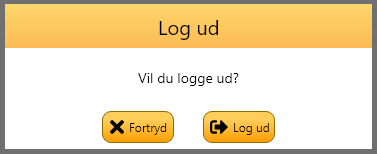
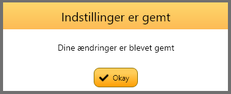
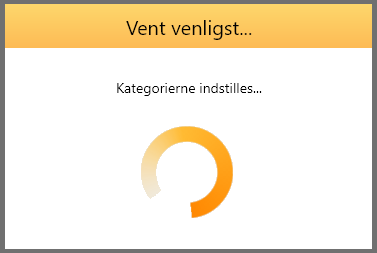
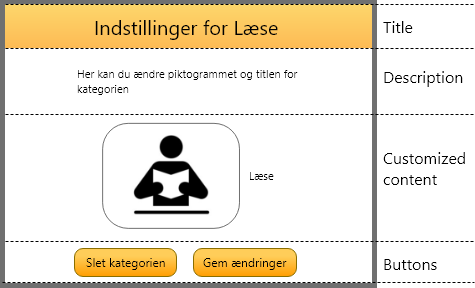

# Dialog
When a user has to respond to an event, dialogs should be used. A dialog consists of a title, a
description, some buttons and possibly some additional views.

## Confirm dialog
When a user needs to confirm that some action is going to happen, the confirm dialog should be
used as it looks here

## Notify dialog
When a user needs to be notified that some action has happened, the notify dialog should be used as
it looks here

## Waiting dialog
In cases where the system needs to perform some action that takes a long time to execute, 
to indicate that the system is not frozen, the waiting dialog, as it looks here, can be used. 

Long running tasks should generally not block the GUI. Any task that can potentially take a long
time should be done on a background thread and NOT on the main GUI thread.

## Custom buttons dialog
For dialogs that contain more than two buttons, the Custom buttons dialog can be used as it is seen here.
The buttons used for it should comply with the design guides for buttons.

## Customized dialog

Some uses of dialogs might be more specialized than the already existing ones. If one wants to add input fields or a custom view
one should use the dialog shown here. This example shows theusecase when a user needs to edit a category.

It is important that if buttons should be added to this type of dialog it must be
placed in the very bottom of the dialog and should be divided as shown in the example Also
note that buttons should be 40dp in height.