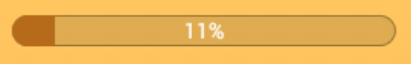

## Loading indicators
The system should show loading indicators whenever it is performing an action that might take a while to process.

There are two kinds of loading indicators:

## Progress bar
The progress bar should be shown if there is a reliable way of calculating the actual progress of the running task.

## Loading spinner
If there is no reliable way of calculating the actual progress of a running task, a loading spinner should be displayed to ensure that the user does not think that the system is frozen.

A method that shows the the loading spinner widget has been created in the weekplanner repo which should be used for loading spinners throughout the weekplanner app.