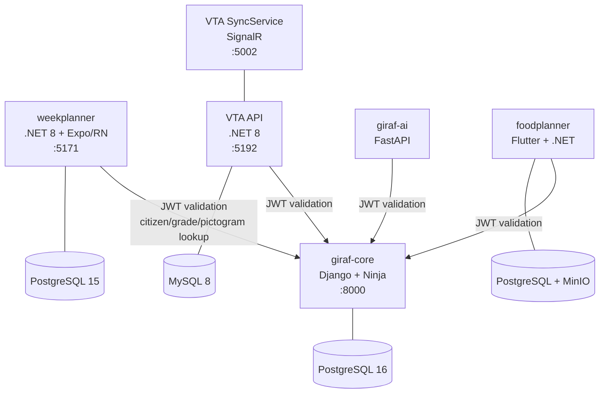

# Architecture

GIRAF is a multi-app platform for children with autism. A shared Core service handles identity, organizations, and shared resources. Each app has its own backend that stores only domain-specific data and validates Core-issued JWTs.

## Ecosystem



## Systems

| System | Port | Tech Stack | Database | Default Branch | Repo |
|--------|------|------------|----------|----------------|------|
| giraf-core | 8000 | Django + Ninja | PostgreSQL 16 | `main` | [giraf-core](https://github.com/aau-giraf/giraf-core) |
| weekplanner | 5171 | .NET 8 + Expo/RN | PostgreSQL 15 | `main` | [weekplanner](https://github.com/aau-giraf/weekplanner) |
| VTA API | 5192 | .NET 8 | MySQL 8 | `dev-main` | [visual-tangible-artefacts](https://github.com/aau-giraf/visual-tangible-artefacts) |
| VTA SyncService | 5002 | .NET 8 + SignalR | — | `dev-main` | (same repo) |
| giraf-ai | — | FastAPI (Python) | — | `main` | [giraf-ai](https://github.com/aau-giraf/giraf-ai) |
| foodplanner | — | Flutter + .NET | PostgreSQL + MinIO | `staging` | [foodplanner](https://github.com/aau-giraf/foodplanner) / [foodplanner-api](https://github.com/aau-giraf/foodplanner-api) |

## Shared JWT Auth

Core issues JWTs (HS256) containing an `org_roles` claim that maps organization IDs to roles:

```json
{"org_roles": {"1": "owner", "5": "member"}}
```

Role hierarchy: **owner > admin > member**.

All backends validate tokens locally using a shared `JWT_SECRET`. No network call to Core is needed for authorization. See [ADR-0001](decisions/0001-shared-jwt-auth.md).

## Repository Map

| Repository | Description |
|------------|-------------|
| [giraf-core](https://github.com/aau-giraf/giraf-core) | Shared identity and resource service |
| [weekplanner](https://github.com/aau-giraf/weekplanner) | Week planner app (backend + frontend) |
| [visual-tangible-artefacts](https://github.com/aau-giraf/visual-tangible-artefacts) | VTA app, API, SyncService, admin dashboard |
| [giraf-ai](https://github.com/aau-giraf/giraf-ai) | AI image generation + TTS |
| [foodplanner](https://github.com/aau-giraf/foodplanner) | Food planner Flutter frontend |
| [foodplanner-api](https://github.com/aau-giraf/foodplanner-api) | Food planner .NET backend |
| [wiki](https://github.com/aau-giraf/wiki) | This documentation site |
| [deploy](https://github.com/aau-giraf/deploy) | Docker Compose deployment for Core + Weekplanner |

## Further Reading

- Per-app architecture details: [Development](../Development/index.md)
- Architecture Decision Records: [decisions/](decisions/)
