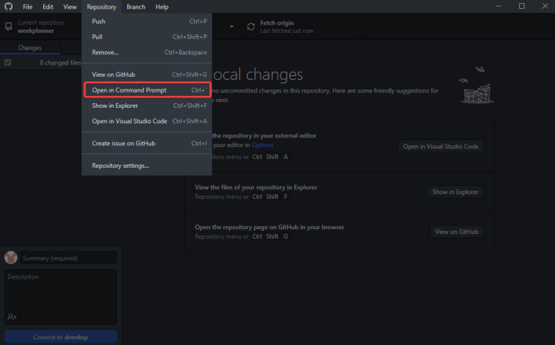

# Development Environment Setup

Apps in GIRAF are developed using Flutter. The setup of the development
environment is described below. It can be used by Windows, Mac and Linux users.

## Downloading and Installing Flutter 3.3.8

1. Go to [flutter.dev](https://flutter.dev/docs/get-started/install) and select
   your operating system and [3.3.8 version of flutter](https://flutter.dev/docs/development/tools/sdk/releases) which has been tested and is guaranteed to work with the GIRAF project.
    - Make sure you have Git installed.
    - For Mac: Make sure you have the listed command-line tools available.
    - For Linux: Make sure you have the listed command-line tools and shared libraries
     available.
1. Follow the instructions on how to download and unzip Flutter.
1. Update your path according to the instructions.

## Android Setup

1. [Download and install Android Studio](https://developer.android.com/studio).
    - On Windows setting up a virtual device with Android Studio is quite simple: 
    In Android Studio, click the “Device manager” button in the top right corner.

    

    Create a new device by clicking Add Virtual Device in the bottom right corner of the popup.

    As the GIRAF weekplanner app is supposed to be used on a tablet, it makes the most sense for you to have a tablet virtual device.

    Choose tablet in the category tab and choose any device, e.g., pixel C

    

    Choose an android version to run on your virtual device e.g., android R API level 30.

    After finishing the installation, confirm that your virtual device works. Go to AVD-manager and 
    click the green arrow in the row of the virtual device you want to start.
    
    

    - On Mac Install android-sdk `brew install android-sdk`
    To ease the use of Android please add the following to your environment variables: 
    A new variable called ANDROID_HOME, which should point to your Android installation directory (It will probably be located at "~/Library/Android/sdk)
    and a new path to your PATH variable, which should point to the sdk/platform-tools and sdk/cmdline-tools/latest/bin folder of your Android installation. 
    Install [dotnet 6.0](https://dotnet.microsoft.com/en-us/download/dotnet/6.0), if not done automatically then add the .dotnet/tools to your PATH.
    Install additional libraries. Use the following commands to install needed libraries for dotnet:
    `/bin/bash -c "(curl -fsSL https://raw.githubusercontent.com/Homebrew/install/HEAD/install.sh)"` and `brew install mono-libgdiplus`
    Install [MySQL Server 8.0](https://dev.mysql.com/downloads/mysql/) or run this command: `brew install mysql`
    When installing/setting up set the root user's password to password.
    Install android system image and tools:

    For x86-64 macs: `sdkmanager "platform-tools" "platforms;android-33" “emulator” “extras;google;auto” “system-images;android-33;google_apis;x86_64” “system-images;android-33;google_apis_playstore;x86_64”`

    For ARM macs: `sdkmanager "platform-tools" "platforms;android-33" “emulator” “extras;google;auto” “system-images;android-33;google_apis;arm64-v8a” “system-images;android-33;google_apis_playstore;arm64-v8a”`

    Create virtual device (Pixel C with device id 27, which is a tablet):

    For x86-64 macs: `avdmanager create avd -n pixel_c -k “system-images;android-33;google_apis;x86_64” -d 27`

    For ARM macs: `avdmanager create avd -n pixel_c -k “system-images;android-33;google_apis; arm64-v8a” -d 27`

    Set the available RAM for the virtual device to 2GB `emulator -avd pixel_c -partition-size 2048 -wipe-data`

    Use the keyboard to type instead of the emulated touchscreen

    Navigate to /Users/you/.android/avd/pixel_c.avd

    Use a text editor to edit “config.ini”

    Find the line that says `hw.keyboard=no`
    
    Change it to `hw.keyboard=yes`

    - On Ubuntu there was a problem with the newest version of Android Studio throwing weird Java 
    errors when you would try to build. It worked with version 4.0.2. You can download any version 
    from their [Android Studio Archive](https://developer.android.com/studio/archive).

1. If you have an Android device, [enable USB debugging](https://developer.android.com/studio/debug/dev-options)
   and plug it in to your computer.
    - For Windows: You might need to install the [Google USB Driver](https://developer.android.com/studio/run/win-usb).
1. [Setup the Android emulator](https://flutter.dev/docs/get-started/install/windows#install-android-studio)
   and run it.

## Do a test run

To make sure everything is as it should be, run the command `flutter doctor`in a terminal.

The first time you do this, it should give a warning at the Android tool-chain step that you need 
to accept android licenses. Do this by running the command `flutter doctor --android-licenses`.

If you get any errors, go to File→Settings


Now direct to Appearance & Behaviour→System Settings→Android SDK, then go to the SDK-tools 
tab.


Here make sure that you have the newest versions of at least Android SDK buildtools, Android 
Emulator, Android SDK platform tools, Intel x86 emulator accelerator and Andorid SDK 
Command-line Tools.

When flutter doctor is happy, launch your android or iOS virtual device. It should now show up 
in flutter devices. Select it and click Run (the green arrow right of flutter devices)


The GIRAF weekplanner app should then start compiling, this may take several minutes, and even 
longer the first time. When it is done, it should print something along the lines of “Syncing files to 
device sdk gphone x86 arm..”. in the Run console, and the app will be launched in your emulator.

- For MacOS using iOS emulator: If you get an error related to pod install, try deleting the file weekplanner→ios→Podfile

## Using the android emulator without Android Studio 

We found it especially useful to use other IDE’s than Android Studio while using the emulator 
outside Android Studio, so here is a guide on how to run the emulator outside Android Studio.

- Windows: First of all, search for `%appdata%` in the search bar and open the appdata folder.


Now exit the `“Roaming”` folder and enter the `“AppData”` folder


Once you are in this folder, locate to `“\Local\Android\Sdk\tools”`.


Now once you have made your way to this folder, go into the directory and type `“cmd”`. This 
should open a command prompt at this location.


 you have the command prompt open at the specified location, type in `“emulator -list-avds”`. This should return a list with the name of the AVD you have created.

 After this, run the command `“emulator -avd <YOUR_AVD_NAME>”`.


 This should launch your virtual device.


You are now ready to run the weekplanner. IDE´s such as Visual Studio Code should 
automatically recognize that you have an AVD running.

## Random issues we found

This section is for minor issues we found when setting up GIRAF. You might not encounter any 
of these issues.

- Using GitHub to open command prompt and run flutter: We found out that opening your command prompt via. the option on GitHub, causes your flutter commands to not be recognized. 



However, this problem can be fixed by either restarting your computer to allow your user path 
variables to take effect or simply locating the weekplanner folder manually and then typing 
`“cmd”` in the directory.

## iOS and iPadOS Setup - MAC ONLY

1. Download the latest version of Xcode from the App Store.
1. Setup the command line tools, to use the new version of Xcode you just installed:

    ```bash
    sudo xcode-select --switch /Applications/Xcode.app/Contents/Developer
    sudo xcodebuild -runFirstLaunch
    ```

1. Also make sure you have accepted the license agreement:

    ```bash
    sudo xcodebuild -license
    ```

1. You can open the simulator app by finding it with spotlight, or by running:

    ```bash
    open -a Simulator
    ```

1. If you want, run the following command to allow full screen mode:

    ```bash
    defaults write com.apple.iphonesimulator AllowFullscreenMode -bool YES
    ```

1. Install cocoapods:

    ```bash
    sudo gem install cocoapods
    pod setup
    ```

### Personal Apple Developer Account

To get a personal Apple Developer account, you need to follow the following steps.

1. Launch Xcode.
1. Invoke __Xcode > Preferences__ (<kbd>⌘+,</kbd>).
1. Go to Accounts, and add one by clicking the __+__ icon. Sign in with your Apple
   ID.
1. Select your account and click __Manage Certificates__ and then click
   the __+__ icon.

You now have an Apple Developer certificate. You may need to add new ones once in
a while, but just follow steps 1, 2 and 4.

Now you need to add yourself as a developer to the Flutter project. To do this,
you need to open the project in Xcode.

1. Open a new project in Xcode with __File > Open__ (<kbd>⌘+O</kbd>) and locate
   the `ios` folder. This is the one you should open. 
1. Now you should be able to see the two folders `Runner` and `Pods` in the left
   column. Double click on `Runner` and click on __Signing & Capabilities__. 
1. Here you need to add yourself as the team. You also need a unique Bundle Identifier,
   so just write some string that is unique.

If you want to deploy to a physical iOS device, you need to first accept your
computer (when connecting to a device), and then accept yourself on the device as
a developer. After building the project in Xcode to your device, you should go
to __Settings > General > Device Management__ and add yourself as a trusted developer.

Note that __Device Management__ option only appears after the project is build.
There, you need to select and trust yourself as a developer.

## Setup Your IDE

### IntelliJ and Android Studio

1. Start IntelliJ/Android Studio.
1. Open plugin preferences.
    - Windows/Linux: __File > Settings (<kbd>Ctrl+Alt+S</kbd>) > Plugins__.
    - MacOS: __IntelliJ IDEA > Preferences (<kbd>⌘+,</kbd>) > Plugins__.
1. Select __Marketplace__, find the Flutter plugin and click __Install__.
1. Click __Yes__ when prompted to install the Dart plugin.
1. Click __Restart__ when prompted.

### Visual Studio Code

1. Start VS Code.
1. Invoke __View > Command Palette__ (<kbd>Ctrl+Shift+P</kbd>/<kbd>⌘+Shift+P</kbd>).
1. Type "install" and click on `Extensions: Install Extensions`.
1. Type "flutter" in the extensions search field, select Flutter in the list, and
   click Install. This also installs the required Dart plugin.

### Verify Setup

1. Run `flutter doctor` to verify that everything is setup properly:
   
   <sub>Note: You only need checkmarks for the IDE that you use for Flutter.</sub>

## Compiling and Running

### IntelliJ and Android Studio

1. Invoke __File > Open__ and select the root folder of the project.
1. Open `/pubspec.yaml` and press __Packages get__.
1. Select an Android/iOS virtual device or the Android/iOS device in the toolbar.  
    
    -  If the virtual device doesn't show up in the IDE toolbar, and the "Open
       Android Emulator: …" option is not shown, use `flutter emulators` to list
       available emulators and then run `flutter emulators --launch <emulator id>`
       to launch it. It should then appear in the toolbar.
1. Make sure that `main.dart` is selected as the run configuration.
1. Press 
   to run without debugging or  to debug.
1. While the app is running, save files or press 
   to apply the changes instantly.
    - Some changes requires using hot restart ().
      See [docs](https://flutter.dev/docs/development/tools/hot-reload) for more
      information.

### Visual Studio Code

1. Invoke __File > Open Folder__ (<kbd>Ctrl+K Ctrl+O</kbd>/<kbd>⌘+O</kbd>), and
   select the root folder of the project.
1. Invoke __View > Command Palette__ (<kbd>Ctrl+Shift+P</kbd>/<kbd>⌘+Shift+P</kbd>).
1. Type "Flutter" and click on `Flutter: Packages Get`.
1. Locate the VS Code status bar:  
   
1. Select a device.
    - If no devices are available and you want to use a virtual device,
      click on __No Device__ and select a virtual device to start.
    - Otherwise, make sure that your physical device is connected and setup properly.
1. Go to the __Debug and Run__ menu ().
1. Press __Create a launch.json file__.
1. Invoke __Debug > Start Debugging__ or __Debug > Run without debugging__ as normal.
1. While the app is running, save files or press 
   to apply the changes instantly.
    - Some changes requires using hot restart ().
      See [docs](https://flutter.dev/docs/development/tools/hot-reload) for more information.
