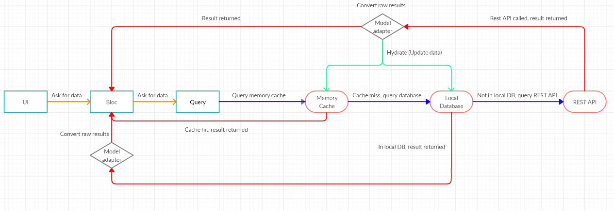

# How to Implement Offline Capabilities

**Flutter resources:**

[SQFlite](https://github.com/tekartik/sqflite/blob/master/sqflite/README.md)  

The customers asked for the ability to use the application when they were offline. 
This could for example be when they are on a trip in the forest, where Wi-Fi is not 
an option and cell service might be really bad. 

## Current solution

We have chosen an offline first approach because if Giraf wants to be
a widely used app on different app markets, it is expected to be highly functional
without internet connection and offline first generally seems to be the way to do this. 

This model describes how offline first can be done with the BLoC pattern. 

Whenever the UI needs data it first communicates with the BLoC, where the BLoC
then sends a query to get the data. If the data is already in memory we can just get
the data. if it is not we try to find it in our local database. If it is not in
the local database either we look in the online database where it should exist.
When you get data from the online database you also save it in the local database
and in memory, such that you can have fast retrieval and also have data available 
if you are offline. Currently, the in memory part has not been the focus of any 
kind of development, and the plan is to simply get the offline mode to work with
an offline database

This setup allows reading from the local database when offline, however in order to
edit, delete or put, without synchronization issues a record of which of these actions
were performed offline will need to be kept such that you can execute them when online again.
To do this will also require regular checks of whether a connection to the database is available.
To best retain the BLoC pattern, and make the offline database and its functionality available
to potential future apps, the offline database is implemented in the api_client.
The offline database is an SQLite database. The reason for this is that mobile devices
already have an SQLite database running in memory for apps to use, and since the online
database uses a MySQL database the mapping between them is relatively easy. Flutter also
provides a package for using SQLite easing the process.

### Issues / considerations

As part of the design a way to handle how and which uses are able to login to the 
offline database is needed. This could possibly be achieved by making it so that only
the most recently logged in user is able to use the device online.

For the pictograms you would also have to figure out some system for determining which
pictograms should be saved locally, since saving every single pictogram might be problematic. 
For these pictograms it is possible to use Flutter's ImageCache,
which would allow images to be accessed offline. At the moment a selfmade cache
is used to store the images. The implementation of this cache can be found [here](https://github.com/aau-giraf/weekplanner/blob/604f6f8973821f65a07a51efd5dec309788f3585/lib/blocs/pictogram_image_bloc.dart).
It could be an option to make it userdefined how much storage the cache is allowed
to use on a device, but if only the most used pictograms are saved, then this should
not be a problem. 
(TODO SNAK OM AT DER ER FLERE MÅDER BILLEDERNE BLIVER GEMT PÅ LIGE NU, BED OM AT NÆSTE HOLD VÆLGER EN AF DEM. CACHE FORSVINDER HVIS DEVICE SLUKKER)

In order to edit the weekplan offline the amount of pictograms have to be limited
since all pictograms cannot be stored locally on the phone. An implementation could
be saving xx recently/most used pictograms for each citizen.
Take picture as pictogram would have to be limited to a certain amount just like
the amount of available pictograms when editing weekplans offline - because it would
take too much space on the device if they took 1000 pictures.
( TODO SKRIV DET HER SAMMEN MED DET LIGE OVER)

Before even starting to implement the features on the prioritized list, it is needed
to be able to login on an offline device.   
One solution could be a setting, where when you are logged in you can allow the
current device to be used in offline mode and the user is saved locally, so it is
possible to login with no internet connection.

#### Here is the prioritized list for the offline features

( TODO TILFØJ ISSUE NUMRE HER)

1. Citizen features: Limited to current week.
    1. View weekplan.
    1. View activity.
    1. Mark activity as completed.
    1. Timer functionality.
1. Guardian features: Limited to current week.
    1. View weekplan.
    1. View activity.
    1. Cancel activity.
    1. Timer functionality.  
    1. Edit weekplan.
1. Guardian features:
    1. Take picture as pictogram.
    1. Create/delete weekplans.
    1. All functions from point 2 just not limited to the current week.

To store the data (activities, timers) locally on the device an SQLite DB is
used. SQLite is a database that is already running on the phone/tablet. It has a
plugin for Flutter (sqflite) which supports both iOS and Android.  

#### Syncing the local database to match the online database

A consideration could be if some data is more important to sync than other and then
make different sync cycles or prioritization, in case the user only has connection
for a short period of time. It could also be considered if all data needs to be
updated all the time or some data just need daily, weekly or monthly updates. Features
that are seen as not important could also be disabled in offline mode in order to
make the amount of offline data as small as possible and keep the complexity of
the synchronization down (at least in the beginning).

*Cache invalidation scenario:*

1. Citizen 1 logs in on their device and downloads their weekplans from the server.
1. Guardian logs in on another device and changes Citizen 1's weekplan for a week.
1. Citizen 1 looks at this weekplan on their device, but this is not the updated
   version since there is a version in the cache.

Possible solutions is to e.g. use a timestamp to check if there is changes in the
online version. This timestamp would be downloaded and checked whenever a weekplan
is opened on a device with an internet connection. Then this timestamp is compared
with the local version.   
Another solution would be to automatically check for changes every e.g. 30 seconds
to avoid having to reopen weekplans to update them. A guardian could also have a
"Refresh" button for the citizens, that would download the new changes.    
Time stamps could also solve the update conflicts since it is possible to compare
to versions and save the newest.   
   
*Synchronizing offline changes scenario:*

1. Citizen's tablet is offline.   
1. A guardian logs in on the same (offline) tablet and changes the citizen's settings.
1. The citizen logs in and can see the local updates.
1. The citizen's device gets internet connection and now the changes has to be synced
   with the database. But the guardian is not logged in anymore and the citizen does
   not have permission to update their changes through the web-api.
  
A possible solution would be to give a citizen permissions in the wep-api to make
changes. 
(TODO EVT SEND NOGET MED FOR AT SIGE DET KOMMER FRA EN OFFLINE DB SÅ DET FÅR PERMISSION)

**A MAJOR issue is if offline changes for the same e.g. activity is made on two
different devices - which of the changes should be saved in the online database,
when they both come online.**  
The main problem is deciding what changes should be saved and what changes should
be discarded.

<ins>Solution: PO-group has talked to the customer and they want "last write wins".</ins>  
   
To accommodate this there might need to add more attributes in the offline and
online databases in order to deal with and keep track of the synchronization.
Examples could be “last_updated_on”, “created_on”, “deleted_on”, “edited_offline”
which are timestamps used to see if data should be synched or not and the “edited_offline”
could be a boolean. It is also an option to use UUID with/instead of timestamps
to make the synchronization have an unique id. 

### What is there currently

Currently an initial class for communication with an offline database exists in the 
[api_client](https://github.com/aau-giraf/api_client) repository in branch [feature/72](https://github.com/aau-giraf/api_client/tree/feature/72).

The [api_client](https://github.com/aau-giraf/api_client) maps JSON output from
the [web-api](https://github.com/aau-giraf/web-api) into models which the
[weekplanner](https://github.com/aau-giraf/weekplanner) uses for displaying data
models. Thus, it would be essential to implement the offline repository feature
in the api_client. Every model in the api_client implements an abstract class called
`Model` which provides a `from_json()` and `to_json()` method for the models to
interact with the web-api. 

#### The 1-1 approach

The solution chosen for the database design is a 1-1 relational database with
the web-api. For this aproach the online database scheme was cloned to a sqlite scheme creation file. From this file, most of the sql was copied into the [dbhandler](https://github.com/aau-giraf/api_client/blob/feature/72/lib/offline_database/offline_db_handler.dart) in the `createTables` method. Some of the tables and rows were though not imported, as they were either not used, or unneceseary for the app to be able to run offline. If more tables or columns are needed  they can simply be added to the table creation function.
If something is to be changed in the model layer, this will be your workload:

1. Alter the modellayer in the web-api
1. Migrate the database 
1. Customize the unittests
1. Customize the integration tests
1. Alter the models in the api_client
1. Customize the unittests
1. Integration test between web_api and api_client
1. Alter the unittests
1. Alter the weekplanner to use the new feature
1. Integration test between weekplanner and the offline repository

Whenever a major change is made to the online database, it is important to also remember to change the offline database to match it, such that everything is saved correctly.

#### Unit tests

In order to test
[SQFlite ffi](https://pub.dev/packages/sqflite_common_ffi)

#### SQLite

[SQLite](https://flutter.dev/docs/cookbook/persistence/sqlite)

