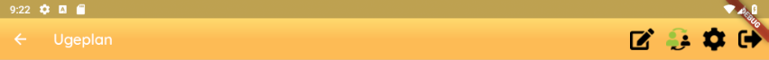

# Application structure

## App bar

The app bar should be present in every screen of the app so that the user can easily
navigate around in the app. The app bar that should always be used is the GirafAppBar,
which is a widget that is implemented in the weekplanner flutter project.
This widget includes all the buttons that should be present on the app bar.

## Bottom bar

Bottom bars must be entirely contextual and depend on the content displayed in the
current activity. The bottom bar should always be styled similarly to the app bar
with the same color.

## Content

The main content of the applications should be focused in the center of the layout
and any menu bars should be above, under, and to the sides of the main content.
The layout should utilize widgets to achieve the desired layout.

## Item familiarity

It is important that the users are familiar with the items they are manipulating.
One should make sure that a given item looks the same when navigating, creating
and editing.
