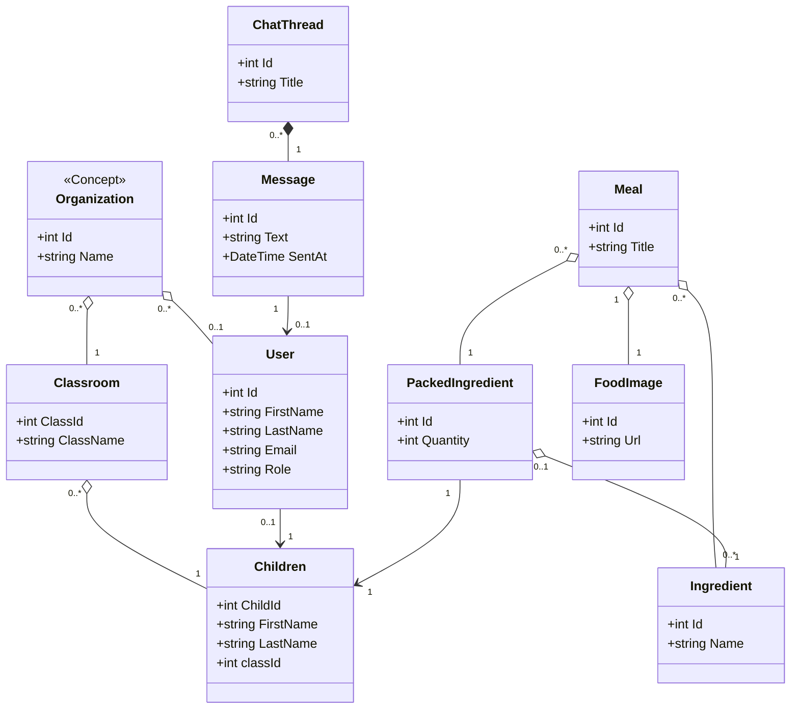

# Class Diagram

```mermaid
classDiagram
    %% --- Classes --
    class Organization {
        <<Concept>>
        +int Id
        +string Name
    }

    class Classroom {
        +int ClassId
        +string ClassName
    }

    class User {
        +int Id
        +string FirstName
        +string LastName
        +string Email
        +string Role
    }

    class Children {
        +int ChildId
        +string FirstName
        +string LastName
        +int classId
    }

    class Meal {
        +int Id
        +string Title
    }

    class Ingredient {
        +int Id
        +string Name
    }

    class PackedIngredient {
        +int Id
        +int Quantity
    }

    class FoodImage {
        +int Id
        +string Url
    }

    class ChatThread {
        +int Id
        +string Title
    }

    class Message {
        +int Id
        +string Text
        +DateTime SentAt
    }

    %% --- Relationships ---

    Organization "0..*" o-- "1" Classroom
    Organization "0..*" o-- "0..1" User

    Classroom "0..*" o-- "1" Children

    User "0..1" --> "1" Children

    Meal "0..*" o-- "0..*" Ingredient

    PackedIngredient "0..1" o-- "1" Ingredient
    PackedIngredient "1" --> "1" Children

    Meal "0..*" o-- "1" PackedIngredient
    Meal "1" o-- "1" FoodImage

    ChatThread "0..*" *-- "1" Message

    Message "1" --> "0..1" User
```
