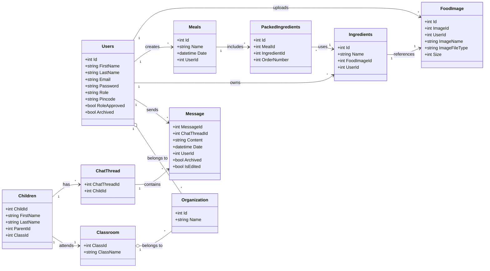

# Class Diagram

```mermaid
classDiagram
    direction LR
    class Users {
        +int Id
        +string FirstName
        +string LastName
        +string Email
        +string Password
        +string Role
        +string Pincode
        +bool RoleApproved
        +bool Archived
    }

    class Children {
        +int ChildId
        +string FirstName
        +string LastName
        +int ParentId
        +int ClassId
    }

    class Classroom {
        +int ClassId
        +string ClassName
    }

    class ChatThread {
        +int ChatThreadId
        +int ChildId
    }

    class Message {
        +int MessageId
        +int ChatThreadId
        +string Content
        +datetime Date
        +int UserId
        +bool Archived
        +bool IsEdited
    }

    class Ingredients {
        +int Id
        +string Name
        +int FoodImageId
        +int UserId
    }

    class Meals {
        +int Id
        +string Name
        +datetime Date
        +int UserId
    }

    class PackedIngredients {
        +int Id
        +int MealId
        +int IngredientId
        +int OrderNumber
    }

    class FoodImage {
        +int Id
        +int ImageId
        +int UserId
        +string ImageName
        +string ImageFileType
        +int Size
    }

    class Organization {
        +int Id
        +string Name
    }

    %% Relationships
    Users "1" o-- "*" Organization : belongs to
    Classroom "1" o-- "*" Organization : belongs to
    Users "1" --> "*" Message : sends
    Users "1" --> "*" Ingredients : owns
    Users "1" --> "*" Meals : creates
    Users "1" --> "*" FoodImage : uploads

    Children "1" --> "1" Classroom : attends
    Children "1" --> "*" ChatThread : has
    ChatThread "1" --> "*" Message : contains
    Meals "1" --> "*" PackedIngredients : includes
    PackedIngredients "*" --> "1" Ingredients : uses
    Ingredients "1" --> "1" FoodImage : references
```
