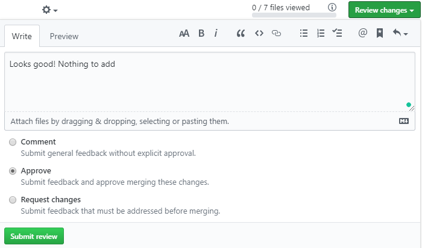

# Using GitHub in GIRAF

Below there will be explain how GitHub is used in the 2020E GIRAF project.

## Issues

Issues can be created by anyone in the GIRAF team.
An issue can be a bug report or a task creation request.

The list of issues can be seen at each repository, eg. <https://github.com/aau-giraf/weekplanner/issues>
, or a [complete list](https://github.com/issues?q=is%3Aopen+is%3Aissue+archived%3Afalse+user%3Aaau-giraf)
for the whole organization.

### Creating an Issue

If you find a bug, or have a task creation request you can create an issue:

1. Go the the "Issues" tab of the relevant repository (E.g. <https://github.com/aau-giraf/weekplanner/issues>).
1. Press the green "New issue" button.
1. Choose whether to submit a bug report or task creation request, and press
   "Get started".
1. Create a title and description for the issue. Please follow the template, and
   do not delete the headers!
    - The title for the *Task Creation Request* should tell what functionality
      you would like added using the shown form "As a developer I would like the
      docker config file to automatically update so that I don´t have to manually
      update the config file". 
      Instead of the task being for the developer, guardian or user is also
      frequently used.
1. Label the issue with appropriate labels.
1. It can be a good idea to inform the PO group when you are done, so they can
   assign and refine the issue.

## Branches and Pull Requests

In GIRAF there is used the branching strategy called [GitFlow](https://www.atlassian.com/git/tutorials/comparing-workflows/gitflow-workflow)
for all the repositories. A visual representation can be seen underneath.


### Working on an Issue

When you want to work on an issue you need to create a feature branch from the
`develop` branch.

The naming convention for feature branches is `feature/xx` where `xx` is
replaced by the issue number.

### Release Preparation

When a Release Preparation phase begins, a release branch is created from the
`develop` branch.
This branch is now used **instead** of `develop` until the release is finished.

The **naming convention** for release branches is `release/<semester name>s<sprint no.>r<release no.>`:

- `<semester name>` is name of a semester e.g. 2020E, 2019 etc.
- `<sprint no.>` the number of the sprint where the release is created
- `<release no.>` the release number. The number starts from 1 and is reset when
  starting on a new sprint.

E.g. `release/2020Es1r1` for semester 2020E, sprint 1, release 1.

#### Release fix

When you start working on a release fix, you create a branch from a release branch
e.g `release/2020Es1r1`.
The naming convention for branch is `releasefix/xx` where `xx` is the issue number.  

### Creating a Branch

From the terminal:

```bash
git checkout develop        # The parent branch
git checkout -b feature/xx  # The new branch
```

Or from GitHub:

1. Make sure the right parent branch is selected, in this instance `develop`.

    
          
2. Input the name of the new branch (e.g. `feature/400`).

    
    
3. Press "Create branch: <name of branch> from '<name of parent branch>'"

#### During Sprints

When you start working on an issue, you create a branch from `develop` called
`feature/xx` where `xx` is the issue number.


#### During Release Preparation

When you start working on a release fix, you create a branch from `release/*`
called `releasefix/xx` where `xx` is the issue number.

```bash
git checkout release/*
git checkout -b releasefix/xx
```

Or from GitHub using the same procedure as above, **but** with the release
branch as base instead, and with the release fix naming convention.

### Creating a Pull Request

When you have finished your issue, it is time to create a pull request.
A pull request is a request to merge your branch into another branch.

Before making the pull request, make sure that the code:

- Only relates to a single issue. (One PR per user story)
- Is fully tested.
- Is reachable when opening the application.

**Fully tested means that if any piece of the functionality is removed, a test
should fail.**

**Creating a pull request on GitHub:**

1. Open the "Pull requests" tab in the repository (e.g. <https://github.com/aau-giraf/weekplanner/pulls>)
1. Press "New pull request"
1. Select the appropriate branch as base.
    - `develop` if during sprint
    - `release/*` if during release preparation
1. Select your branch for as compare
1. Press "Create pull request" 
1. Name the pull request `Feature xx` or `Feature xx: A title describing changes`
1. Write a description
    - If you write `closes #xx` or `fixes #xx`, issue xx will be linked to the PR
      and will close when the PR is merged. ([All keywords](https://help.github.com/en/enterprise/2.16/user/github/managing-your-work-on-github/closing-issues-using-keywords#about-issue-references))

## Code Review

After being assigned a pull request, the group should review the code under the
_Files changed_ tab. Look for code that may be deprecated, unnecessary,
non-optimized or has weird formatting. 

Start at <https://github.com/aau-giraf/>

1. Choose repository eg. weekplanner.
1. Click on the **Pull Request** tab.
1. Choose an open pull request from the list.
1. Click on the **Files Changed Tab**. All the changes can be seen in these files.
    
    1. Make a comment or suggestion on a single line or multiple lines by pressing
        the blue + icon (move the cursor to a line). 
        The red square marks the selection icon which can be used to suggest code
        that replaces the line(s).
        
        You can view what the author will see by clicking **Preview**.
        
1. Having looked over all the files, click **Review changes**.
    1. If you made comments, make sure the author looks them through by choosing
        **Request changes** before clicking **Submit review**. If changes are made,
        you have to re-review the pull request!
        
    1. If the changes makes sense, click **Approve**.
        