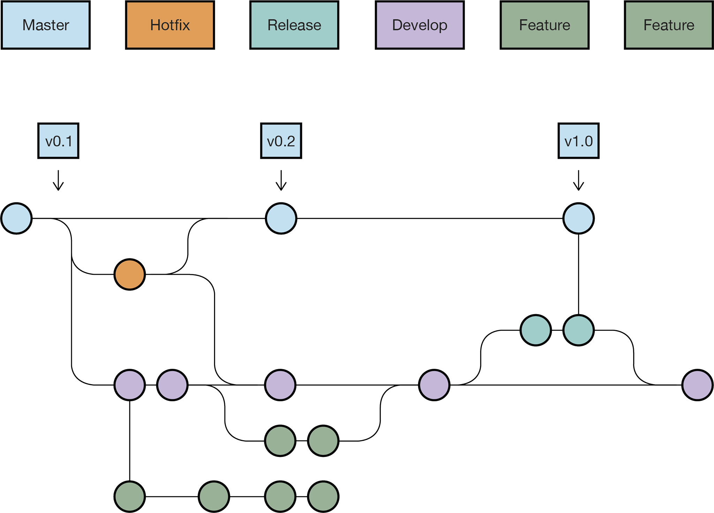

# Using GitHub in GIRAF

This section describes how to use GitHub when you a part of GIRAF.

## Issues

Issues can be created by anyone in the GIRAF team.
An issue can be a bug report or a task creation request.

The list of issues can be seen at each repository, eg. <https://github.com/aau-giraf/weekplanner/issues>
, or a [complete list](https://github.com/issues?q=is%3Aopen+is%3Aissue+archived%3Afalse+user%3Aaau-giraf)
for the whole organization.

### Creating an Issue

If you find a bug, or have a task creation request you can create an issue:

1. Go the the "Issues" tab of the relevant repository (E.g. <https://github.com/aau-giraf/weekplanner/issues>).
1. Press the green "New issue" button.
1. Choose whether to submit a bug report or task creation request, and press
   "Get started".
1. Create a title and description for the issue. Please follow the template, and
   do not delete the headers!
    - The title for the *Task Creation Request* should tell what functionality
      you would like added using the shown form "As a developer I would like the
      docker config file to automatically update so that I don´t have to manually
      update the config file". 
      Instead of the task being for the developer, guardian or user is also
      frequently used.
1. Label the issue with appropriate labels.
1. It can be a good idea to inform the PO group when you are done, so they can
   assign and refine the issue.

## Branches and Pull Requests

In GIRAF there is used the branching strategy called [GitFlow](https://www.atlassian.com/git/tutorials/comparing-workflows/gitflow-workflow)
for all the repositories. A visual representation can be seen underneath.



### Working on an Issue

When you want to work on an issue you need to create a feature branch from the
`develop` branch.

The naming convention for feature branches is `feature/xx` where `xx` is
replaced by an issue number.

### Release Preparation

When a Release Preparation phase begins, a release branch is created from the
`develop` branch.
This branch is now used **instead** of `develop` until the release is finished.

The naming convention for release branches is `release/<semester name>s<sprint no.>r<release no.>`:

- `<semester name>` is name of a semester e.g. 2020E, 2019 etc.
- `<sprint no.>` the number of the sprint where the release is created
- `<release no.>` the release number. The number starts from 1 and is reset when
  starting on a new sprint.

E.g. `release/2020Es1r1` for semester 2020E, sprint 1, release 1.

#### Release fix

When you start working on a release fix, you create a branch from a release branch
e.g `release/2020Es1r1`.
The naming convention for the branch is `releasefix/xx` where `xx` is an issue number.  

### Creating a Branch

From the terminal:

```bash
git checkout develop        # The parent branch
git checkout -b feature/xx  # The new branch
```

Or from GitHub:

1. Make sure the right parent branch is selected (e.g. `develop`).

    
          
2. Input the name of the new branch (e.g. `feature/400`).

    
    
3. Press "Create branch: <name of branch> from '<name of parent branch>'"

### Creating a Pull Request

When you have finished your issue, it is time to create a pull request.
A pull request is a request to merge your branch into another branch.

Before making the pull request, make sure that the code complies with the checklist
for given repository (e.g. 2020E semester [checklists](https://drive.google.com/drive/folders/1PmTdIWJnxRu6Sna63DGSgiIuGB5egfiw?usp=sharing)).

From GitHub:

1. Open the "Pull requests" tab in the repository (e.g. <https://github.com/aau-giraf/weekplanner/pulls>)
1. Press "New pull request"
1. Select the appropriate parent branch as base.
    - `develop` in the Development Phase
    - `release/*` in the Release Preparation
1. Select your branch.
1. Press "Create pull request" 
1. Name the pull request `Feature xx` or `Feature xx: A title describing changes`
1. Write a description
    - If you write `closes #xx` or `fixes #xx`, issue xx will be linked to the PR.
      The linked issues will then be closed the PR is merged. (All keywords can
      be seen [here](https://help.github.com/en/enterprise/2.16/user/github/managing-your-work-on-github/closing-issues-using-keywords#about-issue-references))      

## Code Review

You can find the pull requests you have been requested to review [here](https://github.com/pulls/review-requested).

### Checklist

While reviewing the changes you should use the checklist for a given repository.
It is usually given as a comment on the pull request as seen below.


If it is not, you can insert it yourself (e.g. 2020E semester [checklists](https://drive.google.com/drive/folders/1PmTdIWJnxRu6Sna63DGSgiIuGB5egfiw?usp=sharing)).

Remember to tag yourself with **@GitHub username**, so everyone can see who the
checklist belongs to.

### Changed Files

All the changes associated with a pull request can be found under the
**Files changed** tab as shown underneath.


While reviewing the code you can make comments or suggestions for a single line
or multiple lines by pressing the blue + icon (move the cursor to a line). 
The red square marks the selection icon which can be used to suggest code that
replaces the line(s).
        

        
You can view what the author will see by clicking **Preview**.
        
 

### Give a Review

When you are ready to give your review you press the **Review changes** button. 
Afterwards you are given 3 choices:

- **Comment**
    - If you have comments or questions to the changes in the pull request you
      select this option. However, comments can also be made directly
      to a pull request without giving a review.
- **Approve**
    - If everything is ok, then select this option.
    
    
    
- **Request changes**
    - You select this, if you have made comments to lines in the code or if
      something should be made different. 
      
     
    
When you think your review is done select **Submit review**.

### Re-review

If you have given a review and the author of the pull request makes a new commit,
then you have to re-review the code.       
