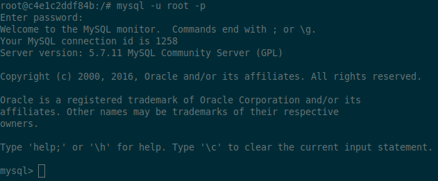

# Database

In order for the new Docker Swarm to serve the Giraf project, the database from
the old servers had to be migrated on to the new ones. In the following the old
setup will be elaborated and the new setup will be explained.

## Old setup

The old server was configured to use MySQL 5.7.11 as can be seen on the picture
below.



In order to migrate the database without changing the database schema the same
version of MySql.
Using standard Mysql commands the database was dumped into a sql file using the
following command:

```bash
mysqldump -u root -p giraf-dev > giraf-dev-dump.sql
```

This command will dump the database `giraf-dev` to a local file giraf-dev-dump
which can be exported to the new server and imported as to a new database.

## New setup

The Docker Compose files was updated with the following:

```yaml
DB:                     # Database service
    image: mysql:8.0.19 # Database version
    command: --default-authentication-plugin=mysql_native_password
    volumes:            # Mount the mysql folder from NFS to container
        - /swarm-nfs/mysql/:/var/lib/mysql/
    environment:        # Set local root password
        MYSQL_ROOT_PASSWORD: <Some password>
    networks:           # Attached network
        - backend
    deploy:             # Settings for deployment
        restart_policy:
            condition: on-failure
```

In order to make the MySQL service work inside a Docker Swarm the MySQL database
files must be synchronized across all servers inside the Swarm. In order to facilitate
this ITS at AAU created an NFS file share that could be mounted in all the servers.
The NFS is mounted at `/swarm-nfs/` on all the servers hence the mountpoint is
the same across all servers.

Once the service is created an empty database will be served by default. The sql
dump from the old setup was imported into the database using the following command:

```bash
mysql -u root -p giraf-dev < giraf-dev-dump.sql
```

By executing this command the data stored in the sql dump will be migrated into
the database.

This new setup will enable the database to be served from all the different servers
inside the Swarm meaning that any of the servers can be terminated without effecting
the overall status of the Giraf project.
