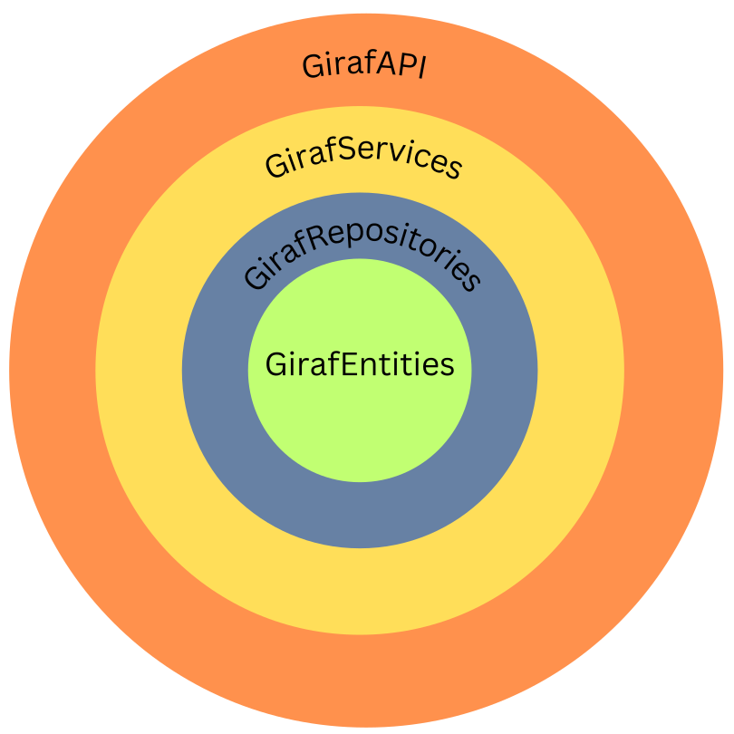
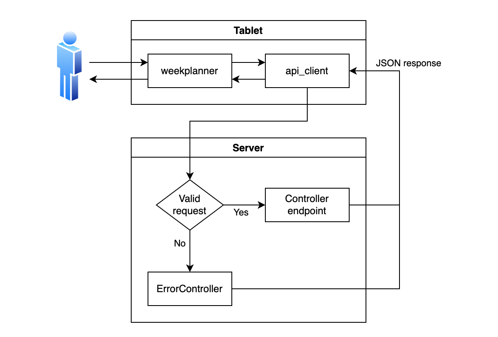

# Architecture

The layered structure presented is implemented with four different projects.
  - GirafAPI
  - GirafServices
  - GirafRepositories
  - GirafEntities

Each of these projects are created to ensure separation of concerns, allowing easier identification of where to add future functionalities. The GirafAPI project handles all aspects of setting up a server for the API to receive and handle requests; this consists mainly of controllers and different settings for running and building the server. The GirafServices contains the business logic and any functionality a controller would need to handle a request, such as hashing. The GirafRepositories project is split into two concerns: one handles communication and setup of the database, and the other access and manipulation of the tables in the database. The last project, GirafEntities, is created to contain all entities and other objects of the API.



The GirafRest solution setup is illustrated in the figure above. <ins>The projects are set up such that a layer references all inner layers</ins>, meaning the GirafAPI references all other projects, while GirafEntities references none. Using this reference structure enforces the communication of each layer only to go inward. This setup indicates that GirafEntities is the lowest layer and GirafAPI is the highest layer.

There are 11 controllers in the web API which are responsible for handling all requests to the API. The controller uses the DTOs to
define the JSON structure for the objects in the HTTP message body, which in turn
are a subset of the ``Model`` classes. To extract information from the database
the controllers uses functionality from services, which use repositories that utilize Entity Framework Core to execute queries to the database.
The controllers also use services to make authentication checks
and other common functionality.

## Making a Request



This figure shows how a request from the user is translated into a JSON response
given the current architecture of the backend.

First, the WeekPlanner will use the generated client-API to make an HTTP request
to the server. On the server the HTTP request is validated with the purpose of
checking whether or not there is a matching URI and HTTP method; if no match is
found the request is redirected to the ```ErrorController``` which sends an error
response as JSON back to the WeekPlanner application to notify the user of this error.

If there is a match, the relevant method is called, which uses the information in
the HTTP body and header to produce a JSON response, which depending on the request
might be a success or error.

To see which method is called, consider the request
``GET http://web.giraf.cs.aau.dk:5000/v1/Pictogram/2/image``.

All controller classes are in the folder ```⋯/GirafRest/Controllers/```, and in
this case the request is route to the ```PictogramController```, because ```/v1/Pictogram```
matches its Route attribute:

```Csharp
[Route("v1/[controller]")]
[Authorize]
public class PictogramController : Controller {...}
```

This controller contains the method

```Csharp
[HttpGet("{id}/image")]
public async Task<Response<byte[]>> ReadPictogramImage(long id) {...}
```

whose attribute matches the ```GET``` verb and the last part of the URI, ```/2/image```.

## The Database


As the figure illustrates, we use the ASP.NET Identity membership system to manage
``Users``. Each user with the citizen role, has a relation to a ``Settings``
entity which defines configurations specific to a ```User``` which can be set in
the WeekPlanner application. Furthermore a ```User``` has a reference to private
``Pictograms`` through the ``UserResources`` which is the pivot table for describing
a many-to-many relationship between ```Users``` and ```Pictograms```.

A ```User``` is also part of a ```Department``` and has a list of weekschedules
which is modelled with the ```Weeks``` entity. A ```Week``` has a reference to up
to seven ```Weekdays``` where each day contains an ```Activity``` which has a reference
to a ```Pictogram```, an order, and a state. An ```Activity``` is thus a ```Pictogram```
that is related to a specific ```WeekDay``` in a ```Week``` and has an order which
indicates the index of the ```Activity``` in the ```Week``` and a state which for
instance can take the values "checked" and "current".

A ```WeekTemplate``` is a generic form of ```Week```, but unlike ```Week```, the
entity does not have a year and week-number and instead of belonging to a ```User```
it belongs to a ```Department```.

```Departments``` like ```Users``` can also own ```Pictograms``` which is modelled
through the ```DepartmentResources``` entity.
