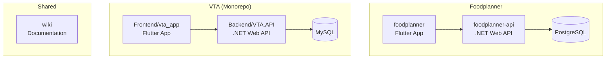
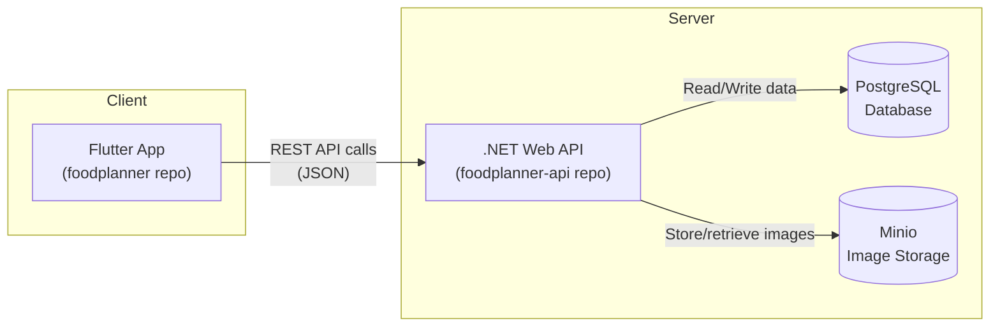
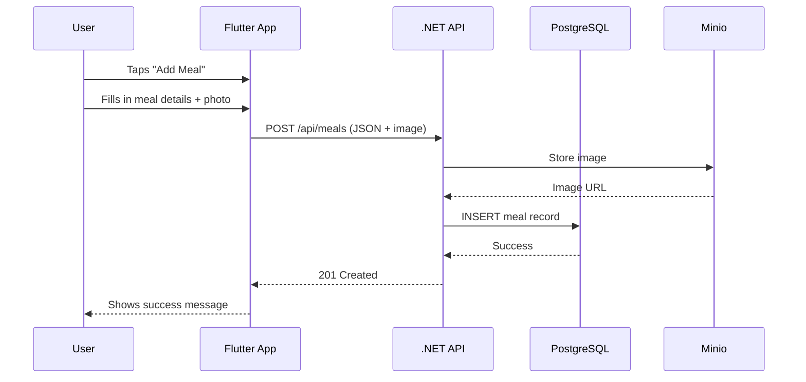
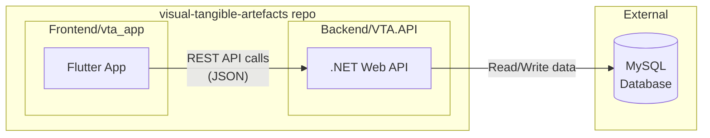
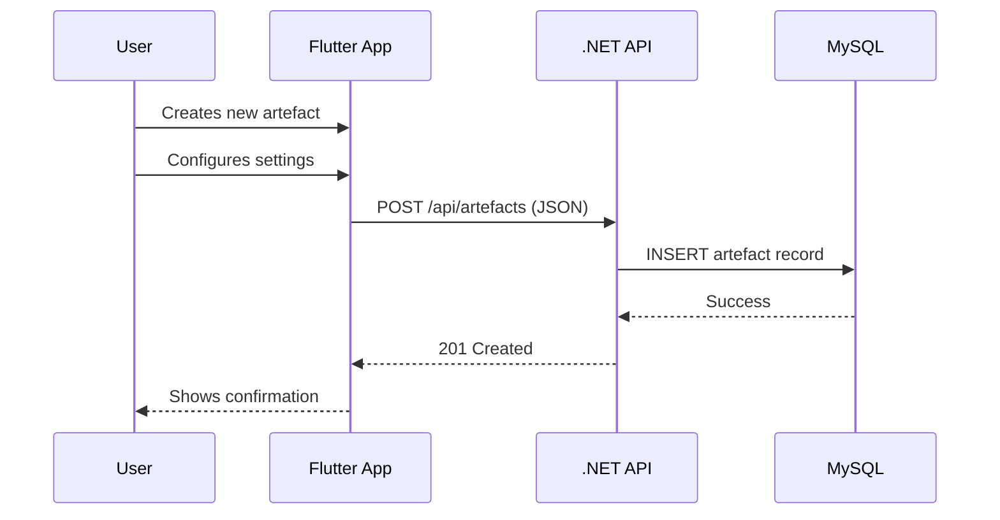

# Architecture Overview

A guide for new students to understand how the GIRAF ecosystem fits together.

## The Big Picture

GIRAF is a collection of apps designed to help autistic children with daily planning. There are multiple apps, each in their own repository:



**Key difference:** Foodplanner uses separate repositories for frontend and backend. VTA is a monorepo with both in one repository.

> **Note:** The `weekplan` repository is archived and no longer actively maintained.

## Foodplanner System Architecture

The foodplanner is currently the most active project. Here's how its pieces connect:



### Data Flow Example

When a user creates a new meal:



## VTA System Architecture

VTA (Visual Tangible Artefacts) is a **monorepo** - both frontend and backend live in the same repository.



### Data Flow Example

When a user creates a new artefact:



### VTA Key Differences from Foodplanner

| Aspect | Foodplanner | VTA |
|--------|-------------|-----|
| Repository structure | Separate repos | Monorepo |
| Database | PostgreSQL | MySQL |
| DB approach | Code-first (migrations) | DB-first (scaffold) |
| Image storage | Minio | Local assets |
| Default branch | `staging` | `dev-main` |
| CI/CD | Manual | GitHub Actions + self-hosted runner |

## Repository Guide

| Repository | What it is | Tech Stack | Default Branch | Status |
|------------|-----------|------------|----------------|--------|
| [foodplanner](https://github.com/aau-giraf/foodplanner) | Mobile/web app for meal planning | Flutter/Dart | `staging` | Active |
| [foodplanner-api](https://github.com/aau-giraf/foodplanner-api) | Backend API for foodplanner | .NET C#, PostgreSQL | `staging` | Active |
| [visual-tangible-artefacts](https://github.com/aau-giraf/visual-tangible-artefacts) | VTA app (self-contained) | Flutter/Dart | `dev-main` | Active |
| [wiki](https://github.com/aau-giraf/wiki) | This documentation | Jekyll/Markdown | `master` | Active |
| [weekplan](https://github.com/aau-giraf/weekplan) | Week schedule planner | TypeScript | - | Archived |

## Where Do I Look?

### Foodplanner

| I want to... | Look in... |
|--------------|------------|
| Change the UI/screens | `foodplanner/lib/pages/` |
| Modify a reusable widget | `foodplanner/lib/components/` |
| Change how data is fetched | `foodplanner/lib/services/` |
| Add/modify an API endpoint | `foodplanner-api/` |
| Change database schema | `foodplanner-api/` (EF migrations) |

### VTA

| I want to... | Look in... |
|--------------|------------|
| Change the UI/screens | `visual-tangible-artefacts/Frontend/vta_app/lib/` |
| Add/modify an API endpoint | `visual-tangible-artefacts/Backend/VTA.API/` |
| Change database schema | Database directly, then scaffold |
| Run tests | `visual-tangible-artefacts/Backend/VTA.Tests/` |

### Shared

| I want to... | Look in... |
|--------------|------------|
| Update documentation | `wiki/docs/` |

## Tech Stack Summary

### Foodplanner

**Frontend (foodplanner)**
- **Flutter** - Cross-platform UI framework
- **Dart** - Programming language
- **GoRouter** - Navigation/routing
- **OpenAPI Generator** - Auto-generates API client code

**Backend (foodplanner-api)**
- **.NET / ASP.NET Core** - Web framework
- **C#** - Programming language
- **Entity Framework Core** - ORM for database access
- **PostgreSQL** - Relational database
- **Minio** - S3-compatible image storage

### VTA

**Frontend (Frontend/vta_app)**
- **Flutter** - Cross-platform UI framework
- **Dart** - Programming language

**Backend (Backend/VTA.API)**
- **.NET / ASP.NET Core** - Web framework
- **C#** - Programming language
- **Entity Framework Core** - ORM (DB-first with scaffold)
- **MySQL** - Relational database
- **Testcontainers** - Integration testing with disposable MySQL instances

## Key Concepts

### Foodplanner: API Code Generation

The foodplanner app doesn't manually write API calls. Instead:

1. The backend exposes an OpenAPI spec
2. Running `dart run build_runner build` generates Dart client code
3. This means: **backend must be running locally to regenerate the API client**

### VTA: Database-First Workflow

VTA uses a **DB-first approach** - the database schema is the source of truth:

1. Design/modify tables directly in MySQL
2. Scaffold models from the database:
   ```bash
   dotnet ef dbcontext scaffold "server=...;database=VTA" \
     Pomelo.EntityFrameworkCore.MySql -o scaffold -f
   ```
3. This regenerates C# model classes to match the schema

### VTA: CI/CD Pipeline

VTA has automated CI/CD via GitHub Actions:

- **CI** runs on all pushes/PRs to `dev-main` or `main`
- **CD** deploys to VPS when merged to `main`
- Tests use Testcontainers to spin up temporary MySQL instances

### Branch Strategies

**Foodplanner:**
- `staging` → `main`
- Feature branches: `feat/group-name/feature-name`

**VTA:**
- `dev-main` → `main`
- Feature branches: `feature/issue-123-description`

### Different Default Branches

Watch out - repos use different defaults:

- foodplanner: `staging`
- foodplanner-api: `staging`
- wiki: `master`
- visual-tangible-artefacts: `dev-main`
