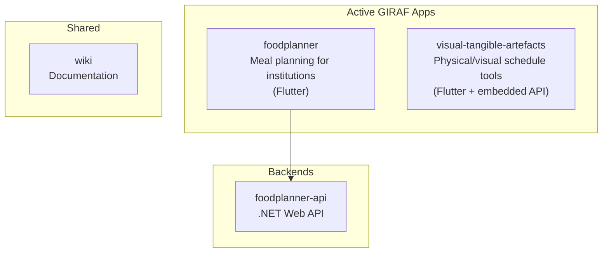
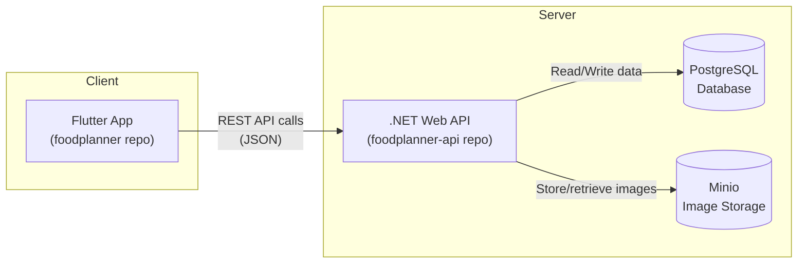
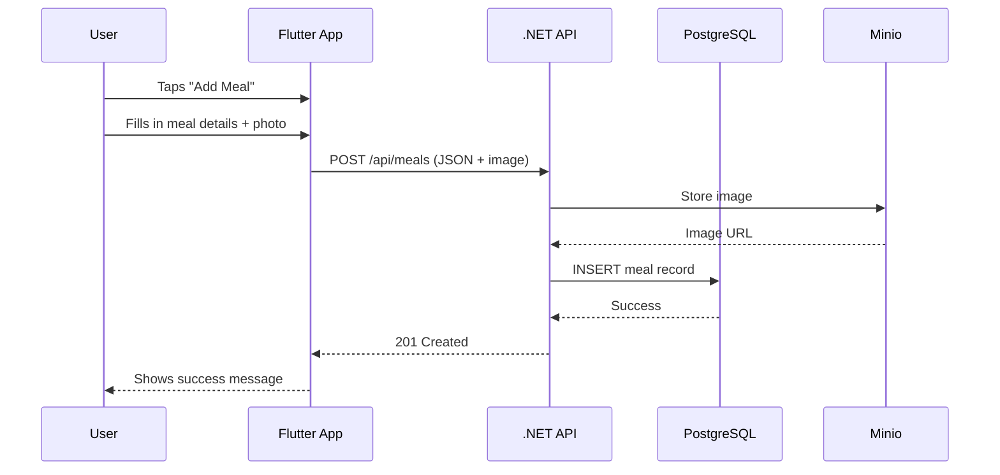

# Architecture Overview

A guide for new students to understand how the GIRAF ecosystem fits together.

## The Big Picture

GIRAF is a collection of apps designed to help autistic children with daily planning. There are multiple apps, each in their own repository:

> **Note:** The `weekplan` repository is archived and no longer actively maintained.

## Foodplanner System Architecture

The foodplanner is currently the most active project. Here's how its pieces connect:

### Data Flow Example

When a user creates a new meal:

## Repository Guide

| Repository | What it is | Tech Stack | Default Branch | Status |
|------------|-----------|------------|----------------|--------|
| [foodplanner](https://github.com/aau-giraf/foodplanner) | Mobile/web app for meal planning | Flutter/Dart | `staging` | Active |
| [foodplanner-api](https://github.com/aau-giraf/foodplanner-api) | Backend API for foodplanner | .NET C#, PostgreSQL | `staging` | Active |
| [visual-tangible-artefacts](https://github.com/aau-giraf/visual-tangible-artefacts) | VTA app (self-contained) | Flutter/Dart | `dev-main` | Active |
| [wiki](https://github.com/aau-giraf/wiki) | This documentation | Jekyll/Markdown | `master` | Active |
| [weekplan](https://github.com/aau-giraf/weekplan) | Week schedule planner | TypeScript | - | Archived |

## Where Do I Look?

| I want to... | Look in... |
|--------------|------------|
| Change the UI/screens | `foodplanner/lib/pages/` |
| Modify a reusable widget | `foodplanner/lib/components/` |
| Change how data is fetched | `foodplanner/lib/services/` |
| Add/modify an API endpoint | `foodplanner-api/` |
| Change database schema | `foodplanner-api/` (migrations) |
| Update documentation | `wiki/docs/` |
| Work on VTA | `visual-tangible-artefacts/` (has its own API built-in) |

## Tech Stack Summary

### Frontend (foodplanner)
- **Flutter** - Cross-platform UI framework
- **Dart** - Programming language
- **GoRouter** - Navigation/routing
- **OpenAPI Generator** - Auto-generates API client code

### Backend (foodplanner-api)
- **.NET / ASP.NET Core** - Web framework
- **C#** - Programming language
- **Entity Framework Core** - ORM for database access
- **PostgreSQL** - Relational database
- **Minio** - S3-compatible image storage

## Key Concepts

### API Code Generation

The foodplanner app doesn't manually write API calls. Instead:

1. The backend exposes an OpenAPI spec
2. Running `dart run build_runner build` generates Dart client code
3. This means: **backend must be running locally to regenerate the API client**

### Branch Strategy

- `staging` - Integration branch, PRs go here first
- `main` - Production-ready code
- Feature branches: `feat/group-name/feature-name`
- Bugfix branches: `bugfix/group-name/bug-name`

### Different Default Branches

Watch out - repos use different defaults:

- foodplanner: `staging`
- foodplanner-api: `staging`
- wiki: `master`
- visual-tangible-artefacts: `dev-main`
