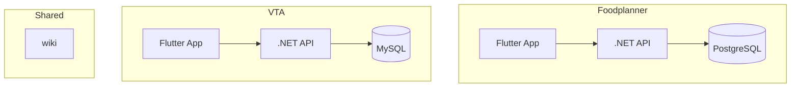
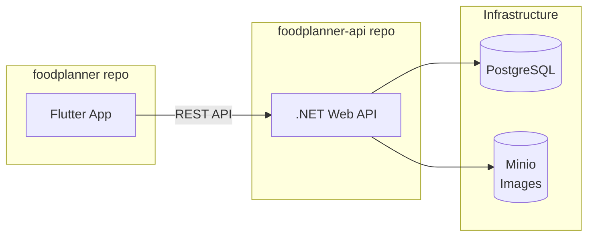
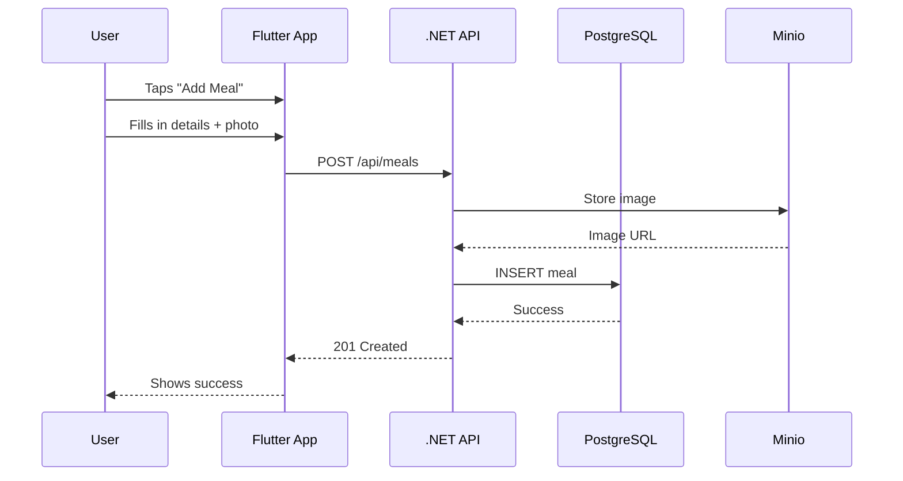
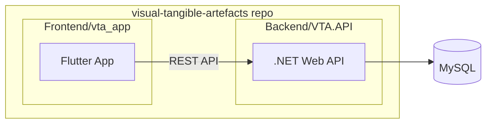
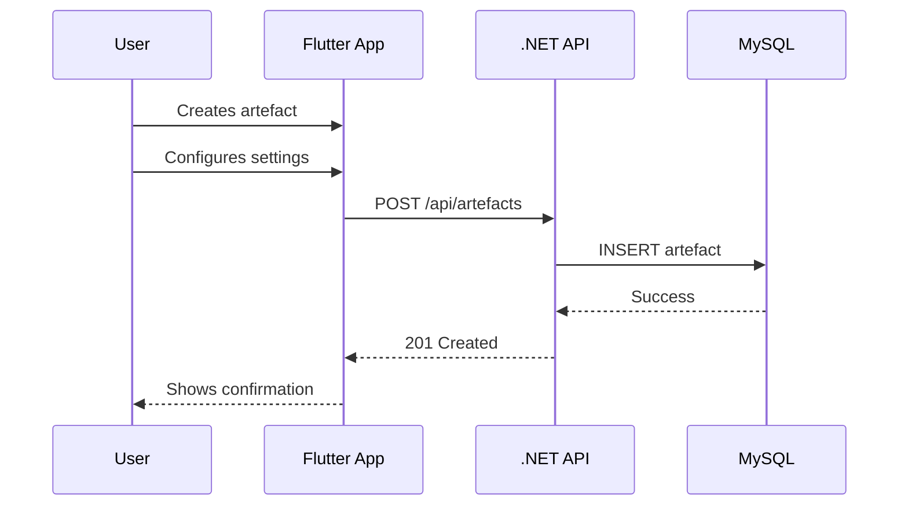

# Architecture Overview

A guide for new students to understand how the GIRAF ecosystem fits together.

## The Big Picture

GIRAF consists of two active projects, each serving different needs for autistic children:



| Project | Purpose | Structure |
|---------|---------|-----------|
| **Foodplanner** | Meal planning for institutions | Separate repos for frontend + backend |
| **VTA** | Visual/physical schedule tools | Monorepo (frontend + backend together) |

> **Note:** The `weekplan` repository is archived and no longer maintained.

---

## Foodplanner

Meal planning app for institutions. Uses **separate repositories** for frontend and backend.

## Repositories

| Repository | Description | Default Branch |
|------------|-------------|----------------|
| [foodplanner](https://github.com/aau-giraf/foodplanner) | Flutter mobile/web app | `staging` |
| [foodplanner-api](https://github.com/aau-giraf/foodplanner-api) | .NET backend API | `staging` |

## Architecture



## Data Flow Example

When a user creates a new meal:



## Where Do I Look

| I want to... | Look in... |
|--------------|------------|
| Change UI/screens | `foodplanner/lib/pages/` |
| Modify reusable widgets | `foodplanner/lib/components/` |
| Change data fetching | `foodplanner/lib/services/` |
| Add/modify API endpoints | `foodplanner-api/` |
| Change database schema | `foodplanner-api/` (EF migrations) |

## Tech Stack

**Frontend:**

- Flutter / Dart
- GoRouter (navigation)
- OpenAPI Generator (auto-generates API client)

**Backend:**

- .NET / ASP.NET Core / C#
- Entity Framework Core (code-first migrations)
- PostgreSQL
- Minio (S3-compatible image storage)

## Key Concepts

### API Code Generation

The Flutter app doesn't manually write API calls:

1. Backend exposes an OpenAPI spec
2. Run `dart run build_runner build` to generate Dart client
3. **Backend must be running locally** to regenerate the API client

### Branch Strategy

- `staging` → `main`
- Feature branches: `feat/group-name/feature-name`
- Bugfix branches: `bugfix/group-name/bug-name`

---

## VTA (Visual Tangible Artefacts)

Visual/physical schedule tools. Uses a **monorepo** with frontend and backend in the same repository.

## Repository

| Repository | Description | Default Branch |
|------------|-------------|----------------|
| [visual-tangible-artefacts](https://github.com/aau-giraf/visual-tangible-artefacts) | Flutter app + .NET API | `dev-main` |

## Architecture



## Data Flow Example

When a user creates a new artefact:



## Where Do I Look

| I want to... | Look in... |
|--------------|------------|
| Change UI/screens | `Frontend/vta_app/lib/` |
| Add/modify API endpoints | `Backend/VTA.API/` |
| Change database schema | Database directly, then scaffold |
| Run/write tests | `Backend/VTA.Tests/` |

## Tech Stack

**Frontend:**

- Flutter / Dart

**Backend:**

- .NET / ASP.NET Core / C#
- Entity Framework Core (DB-first with scaffold)
- MySQL
- Testcontainers (integration testing)

## Key Concepts

### Database-First Workflow

VTA uses **DB-first** - the database schema is the source of truth:

1. Design/modify tables directly in MySQL
2. Scaffold models from the database:

   ```bash
   dotnet ef dbcontext scaffold "server=...;database=VTA" \
     Pomelo.EntityFrameworkCore.MySql -o scaffold -f
   ```

3. This regenerates C# model classes to match the schema

### CI/CD Pipeline

VTA has automated CI/CD via GitHub Actions:

- **CI** runs on all pushes/PRs to `dev-main` or `main`
- **CD** deploys to VPS when merged to `main`
- Tests use Testcontainers to spin up temporary MySQL instances

### Branch Strategy

- `dev-main` → `main`
- Feature branches: `feature/issue-123-description`

---

## Shared Resources

| Repository | Description | Default Branch |
|------------|-------------|----------------|
| [wiki](https://github.com/aau-giraf/wiki) | This documentation | `master` |

Update documentation in `wiki/docs/`.
