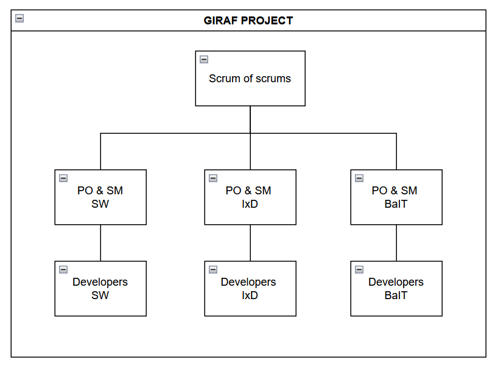
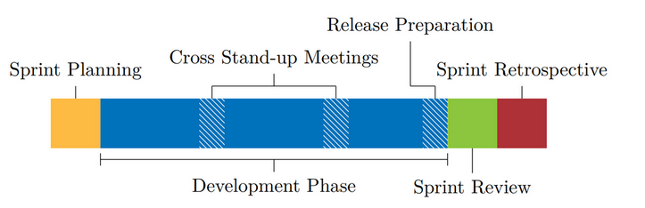

# Process
It is recommended that the groups work agile in this project. This section will provide an insight in the process of the former groups of GIRAF. If this guide is insufficient or you have further questions it is suggested that you contact the Agile Software Engineering (ASE) lecturer. 

The Legacy tab provides former students experiences, primarily regarding the weekplanner project, which although not relevant can provide useful insight. This includes meeting notes with Carsten, the previous ASE lecturer, and many other resources. 

## Role Overview
Roles can either be set for the semester, or alternate such that every student tries every role. (Swapping roles proved difficult and required good communication and notes)

The imagine above shows the general structure in the GIRAF Projects. Each project group has a PO and SM, and these are sent to scrum of scrum meetings forming a PO and SM group which governs the project. The matters discussed in the PO and SM group are then brought back to the project groups and summarized, such that every member of the GIRAF project is up to date. (Groups are encouraged to speak together and knowledge share, however the responsibility lies with the PO and SM to ensure the developers are up to date)

### PO
The PO group consists of a **single** group, which has contact to the stakeholders.

The following things are the responsibility of the members within the PO group:

- Contact with stakeholders
- Maintain Product Backlog
- Create new issues
- Create prototypes if an issue needs one
- Create and conduct usability tests
- Maintain design guidelines
- Decide together with the Process group, which issues that should be in the Sprint Backlog
- Add release descriptions to the Wiki as described in Release Guide
- Can work on issues if necessary

### SM 
The SM group consists of a **single** group, which administers the process of the GIRAF team(s). They enforce the SCRUM rules. 

The following things are the responsibility of the members in the Process group.

- Maintain the process in the GIRAF team
    - Structure of sprint of events
- Plan meetings within the GIRAF team (E.g. location and time for the sprint events)
- Moderator in the sprint events
- Distribute issues from GitHub
- Add reviewers to pull requests
- Decide together with PO, which issues that should be in the Sprint Backlog
- Can work on issues if necessary

### DEV
Remainder of the students are developers. 

- The following things are the responsibility of the members within a Development team.
- Work on issues
- Create new issues
- Review pull requests (This should always be the main priority)

## Sprint Overview

## Before the Sprint Planning
Prior to Sprint Planning the Process group and the PO group have decided which issues to include in the Sprint Backlog. Only those issues will be time estimated and prioritized during Sprint Planning. Minor adjustments may be made afterwards based on the outcome of the Sprint Planning.

Next, everyone is divided into Sprint Planning Cross-groups.

- Each Sprint Planning Cross-group has at least one Process group member and one PO group member. This means that the number of Sprint Planning - Cross-groups cannot exceed the number of members in the Process or PO group.
- The Sprint Planning Cross-groups are created randomly for each sprint.
- The Sprint Planning Cross-groups are send out to the whole GIRAF team prior to the Sprint Planning.

After the Sprint Planning Cross-groups are made, the issues in the Sprint Backlog should be divided evenly between the groups.

This process has been automated through the [Sprint Planning Tool](../Legacy/Handover/2020E/Tools/Process_Group/sprint_planning_tool.md).

### Sprint Planning
Everyone on the GIRAF Scrum team (PO, SM and Development teams) attend this event that marks the start of a sprint.

#### Expected Duration
Max 4 hours (Adjusted for 2 week sprint).
#### Result
A prioritized list of issues for each Development team to work on during the sprint.

## Agenda
1. Process group member presents the following:
    - Changes made to the process, since the previous sprint, based on the information from Sprint Retrospective.
2. PO group member presents the following:
    - Semester goal
        - The overall goal of the project e.g. has the goal changed since last Sprint Planning.
    - Sprint goal
        - The goal of this sprint.
    - New and/or important issues in the sprint
3. Time estimation begins.

## Time Estimation
Time estimation is done through **Planning Poker**

**Remember to include testing, review, documentation and usability test design in your estimations.**

Everyone has ten cards with these numbers:

- 1, 2, 3, 5, 8, 13, 21, 34, 55, 89, 144 (the fibonacci numbers).

5 is equal to an 8-hour work day. The purpose of this is to **not** think of the numbers as hours but as **relative** to one day's workload.

The Process group member has a list of issues the group should time estimate. Each issue is only estimated by one group. For every issue follow these steps:

1. Make sure everyone understands a given issue
    1. Everyone reads the issue
    2. Discuss the issue
    3. If anyone is in doubt about the nature of an issue ask the PO member.
2. Guess the time required to complete an issue.
    1. Everyone picks a card and holds the value secret.
    2. Everyone shows their cards simultaneously.
    3. If the cards are more than two steps apart, then the ones with highest and lowest numbers present their point of view.
        - By more than two steps means that e.g 3 and 8 are two steps apart. 3 and 5 are not.
    4. Repeat steps 2.a-2.c up to 3 times or until an agreement is reached.
        - These scenarios are seen as agreements:
            - If everyone has estimated the issue to the same number. This number is noted.
            - If there is one between the highest and lowest estimate. The highest number is noted.
        - The following is done, if there is no agreement after 3 times:
            - The median or the number closest to the median is noted e.g. with the numbers 3, 3, 5, 8 the median is 4 but 5 is noted since that is the closest fibonacci number.

## After Sprint Planning

When all Sprint Planning Cross-groups have finished time estimation each Development team gets back together to prioritize the issues.

- The prioritization are made according to what the Development team would like to work with.
- All issues in the sprint should prioritized as either:
    - High (Want the most)
    - Medium
    - Low (Want the least)
- This list should be sent to the Process group by the end of Sprint Planning.

The Process group will then assign the Development teams to certain issues. The assignment will use the following constraints:

- As many high priority issues as possible.
- As few low priority issues as possible.
- Equal workload between Development Teams.

The issue assignments will be sent out at most 24 hours later along with a list of which types of issues to solve first e.g. bug fixes before features.

## Development Phase
The Development Phase starts after the Sprint Planning and ends on the day of the Sprint Review.

### Work with Issues
In the Development Phase, the Development teams work with the issues they have been given by the Process group after the Sprint Planning.

#### Need More Issues to Work On
If you have time to work on a additional issues, than the ones that were distributed after Sprint Planning, you can get a new one by following these steps:

1. Find an issue you want to work on in the Sprint Backlog 
2. Ask the Process group if you can work on that issue
    - The Process group might say no for various reasons and they have the final say, as they have a better overview.
    - There is usually a greater chance of getting a yes, if the issue you have picked is either highest or high priority.

If you don't have a preferred issue you can ask the PO group to be assigned the most pressing issue, as they have a good overview of the project and they will most likely have some issues that they would like you to work with.
If a Development team need more issues to work on, they have to contact the Process group.

