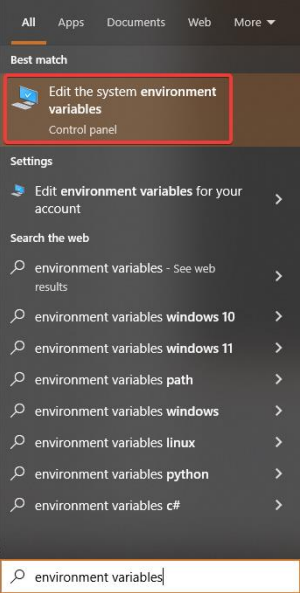
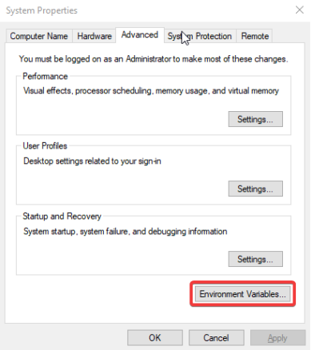
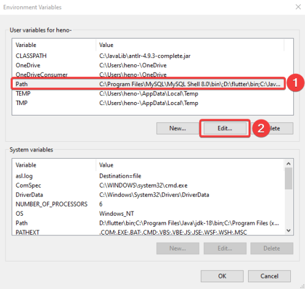
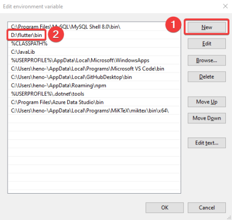
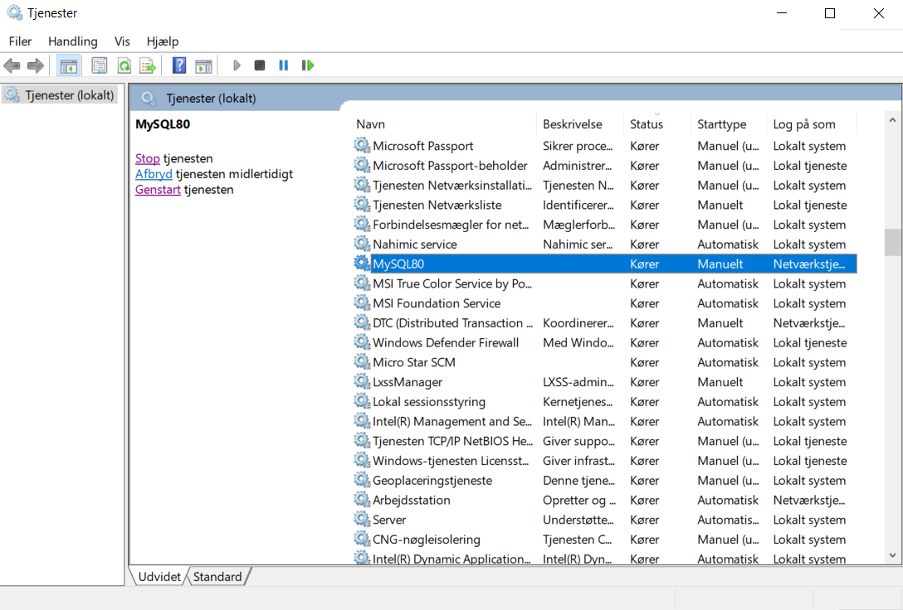

# Setup

## Word or PDF Guide

Here are two hyperlinks leading to the same guide for setting up the following repositories: Weekplanner, API-Client and Web-API. [Word](./guides/GIRAF_Getting_Started_2022.docx) or [PDF](./guides/GIRAF_Getting_Started_2022.pdf) format.

## Weekplanner

## Installing the flutter framework

Download the flutter framework from [Flutter](https://flutter.dev/docs/get-started/install). The GIRAF 
project is guaranteed to work with version 3.3.8.

Just follow the installation guide on the flutter website and you should be good to go.

If you are using Android Studio, IntelliJ or Visual Studio Code, be sure to install the flutter and 
dart plugins to get full flutter support.

## Adding flutter to your path

Adding flutter to your path is highly recommended as it allows you to run flutter commands from 
any terminal window. How to do this is very dependent on your OS so make sure to check the 
flutter installation guide on how to do this on your setup if you did not do it already as part of 
your installation or do the following:

1. 
    In Windows, editing environment variables is quite simple. Open the windows menu or the 
settings menu and search for environment variables.

Here click on the button in the bottom labeled “Environment variables...”

This will open a new window with two lists of environment variables, for the system and for the 
user. Here it is possible to add new and edit existing variables

Most of the variables related to the GIRAF project should be in the upper list, specific for your 
user.
To add a directory to your PATH environment variable, you need to locate the variable Path in 
your user variables and edit it, then add a new line with the path to the directory you want to add.

If a variable named Path does not exist in the list of user variables, click the button New and create one.

If your Path variable exists but only has one value, you can add another value by editing the 
variable and adding the next value separated by a semi colon.

Finally, when you reach this point, you create a new path, which has the location of your 
flutter/bin folder. This now allows you to run flutter commands from any location.

1. 
    On Linux (Ubuntu) there are many ways to edit environment variables. One of the simpler is to 
open a terminal and edit the file etc→environment with your favorite editor e.g., emacs, nano, 
vim, etc. e.g., `sudo nano /etc/environment`. Add or edit the variables that you need. There is one 
variable per line of the form `NAME="value1:value2:value3"`. Save and exit, then reboot your 
PC for it to work
1. 
    How to set environment variables on Mac depends on which shell your terminal is using. Open a 
terminal and type `echo $SHELL` and it will tell you which you are using, typically Bash or Z Shell. 
Use your favorite text editor to edit the file `$HOME/.bashrc` if you’re using Bash and 
`$HOME/.zshrc` if you’re using Z shell, e.g. `sudo nano ${HOME}/.zshrc` This file might not 
already exist, so this might create it, thus opening an empty file. This is OK. Add and edit the 
variables you need. There is one variable per line of the form `NAME="value1:value2:value3”`.
Save and exit and reboot your PC.

NB: If the file did not already exist or did not already contain the PATH environment variable, you 
need to add it as `PATH="${PATH}:your-new-path”`, to add paths instead of replacing them.

## Verify

You can always verify that your changes work by opening a terminal and typing `echo $var_name`
e.g., `echo $PATH` or `echo $JAVA_HOME` for Linux and Mac. For Windows using PowerShell, 
type echo $Env:var_name e.g. `echo $Env:Path`

## Installing a java SDK

Android needs a java JDK to compile and run. The weekplanner project currently does not work 
with java newer than version 11, which can be downloaded [here](https://jdk.java.net/java-se-ri/11), for MacOS, download the Linux version. 

After installing java 11, make sure to set your JAVA_HOME environment variable to the java 
root directory, i.e. .../jdk-11, and put java in your PATH environment variable, i.e. .../jdk-11/bin, follow same steps as above.

You might have to restart your PC or IDE to make the new environment variables work.

## Clone the weekplanner repository

In Android Studio, choose project from version control and enter the GIRAF weekplanner url: `https://github.com/aau-giraf/weekplanner.git`

On other IDE´s, you can use GitHub’s desktop app to clone the repository, after which you can 
open it with your own specified IDE.

NB: Note that you will need to be added to aau-giraf GitHub organization to be able to contribute.

NB: Android Studio has built-in GitHub support if you link it to your GitHub account.

## Download packages

Download all necessary packages for the project by running flutter command `flutter pub get` in 
a terminal window at the project root i.e., `…/weekplanner`

## Web-API

Make sure you have a C# compatible IDE e.g., Microsoft Visual Studio or JetBrains Rider.

## Installing dotnet core

The web-api is a dotnet core web app that runs on dotnet core 6.0.x so make sure that you have a 
compatible version installed. It can be downloaded [here](https://dotnet.microsoft.com/en-us/download/dotnet/6.0)

## Installing MySQL 

The web api runs a local instance of a MySQL server.

Install [MySQL server 8.0](https://dev.mysql.com/downloads/mysql/). MySQL workbench 
and MySQL shell are useful but optional. 

During the setup, make sure to give the root user a password you can remember e.g., ”password” 
as this is only a development instance. Additionally, create a user with username “user” and 
password ”password” that have administrative rights.

NB: Make sure that your MySQL server is running (this is where MySQL workbench is useful)

NB: If you are not able to restart or turn the server on/off through the MySQL workbench then the way you do it is through locating the windows search bar and writing `services` where you will need to locate `MySQL80` as seen below and restart it by right clicking it and pressing stop or going to properties and selecting `Manual` if it is set to `Automatic` and pressing on the button that says `Stop`.

- 
    For Linux - Install additional libraries
Run the following commands to install additional libraries (might require sudo privileges): `apt install libc6-dev` and `apt install libgdiplus`.
- 
    For MacOS - Install additional libraries
Run the following commands to install additional libraries (requires sudo privilegess): `/bin/bash -c "(curl -fsSL https://raw.githubusercontent.com/Homebrew/install/HEAD/install.sh)"` and `brew install mono-libgdiplus`

## Clone the web-api repository

In your IDE, create a new repository, in Rider select Get from version control and enter the web-api url: `https://github.com/aau-giraf/web-api.git`

## Establish a query interface to your database

Many IDE’s support a GUI connection to databases e.g., Visual Studio and Rider.

What worked and was used by a lot of groups was [Visual Studio Code's MySQL extension](https://marketplace.visualstudio.com/items?itemName=cweijan.vscode-mysql-client2)

Select the database tab, add an instance, and select MySQL. Use the connection settings:
`Host: localhost`
`Port: 3306`
`Username: root`
`Password: password`
`Database: giraf`

This should establish a connection to your database that allows you to manually edit the tables 
and schemas.

## API-Client

1. 
    Make sure you have the flutter framework installed
1.  
    Clone the api client repository. In your IDE, create a new repository, in Android Studio choose project from version control and 
enter the api_client url: `https://github.com/aau-giraf/api_client.git`
1. 
    Run the flutter command `flutter pub get` in a terminal window at the project root.
1. 
    Set the weekplanner to point at your branch. If you want to test out your changes to the api_client, open weekplanner→pubspec.yaml in the 
weekplanner, find the api_client entry and change ref from `develop` to your branch e.g. `feature/73`. 
Then run flutter pub get again in the weekplanner project to update the package. 

NB: due to caching, simply running pub get is not always enough. If the package is not properly 
updated, delete the build directory from the weekplanner project directory and build the 
application again. It is possible to check the current version of api client your local weekplanner 
uses in Android Studio by opening External Libraries → Dart Packages

NB: Do not push this change to pubspec unless you know what you are doing, and make sure to 
change it back to develop before merging.

