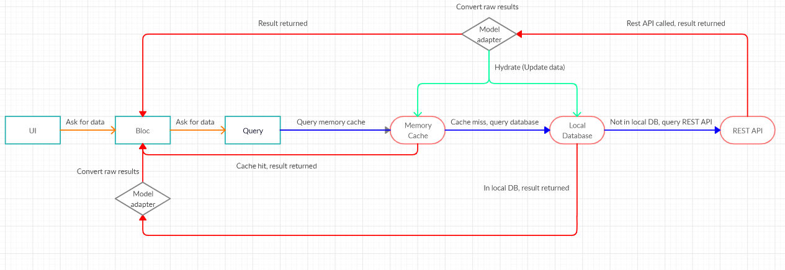

# GIRAF Offline database

The customers wish to use the application when offline. This could for example
be when they are on a trip in the forest, where Wi-Fi is not an option and cell service
might be unavailable. 

## Current solution

We have chosen an offline first approach because if Giraf wants to be
a widely used app on different app markets, it is expected to be highly functional
without internet connection and offline first is generally the way to do this. 



This model describes the dataflow of an offline first database. 
The current offline database implementation is based on this model.

Whenever the UI needs data, it first communicates with the BLoC. The BLoC then queries the API for the data.
If the data is already in memory we can just return it. If it is not, we try to find it in our local database. 
If it is not in the local database either, we look in the online database where it should exist.
When you get data from the online database, you also save it in the local database
and in memory, such that you can have fast retrieval and also have data available 
if you are offline. Currently, the in memory part has not been the focus of any 
kind of development, and the plan is to simply get the offline mode to work with
an offline database.

This setup allows reading from the local database when offline. However, in order to
edit, delete or insert data, without synchronization issues a record of which of these actions
were performed offline will need to be kept such that they can be completed when you are online again.
This will also require regular checks of whether a connection to the database is available.
To best retain the BLoC pattern, and make the offline database and its functionality available
to potential future apps, the offline database is implemented in the api_client.
The offline database is an SQLite database. The reason for this is that mobile devices
already have an SQLite database running in memory for apps to use, and since the online
database uses a MySQL database, the mapping between them is relatively easy. Flutter also
provides a package for using SQLite called [SQFlite](https://github.com/tekartik/sqflite/blob/master/sqflite/README.md)
, easing the process.

Below is a prioritized list of the different features the customers would like to have available offline,
along with what issues in the weekplanner deals with that piece of functionality. Obviously the first
thing which needs to be implemented is the ability to log in offline.

### Here is the prioritized list for the offline features

1. Citizen features: 
    1. View weekplan. ([Issue 414](https://github.com/aau-giraf/weekplanner/issues/414))
    1. View activity. ([Issue 414](https://github.com/aau-giraf/weekplanner/issues/414))
    1. Mark activity as completed. ([Issue 400](https://github.com/aau-giraf/weekplanner/issues/400))
    1. Timer functionality. ([Issue 402](https://github.com/aau-giraf/weekplanner/issues/402))
1. Guardian features: 
    1. View weekplan. ([Issue 415](https://github.com/aau-giraf/weekplanner/issues/415))
    1. View activity. ([Issue 415](https://github.com/aau-giraf/weekplanner/issues/415))
    1. Cancel activity. ([Issue 407](https://github.com/aau-giraf/weekplanner/issues/407))
    1. Timer functionality.  ([Issue 406](https://github.com/aau-giraf/weekplanner/issues/406))
    1. Edit weekplan. ([Issue 407](https://github.com/aau-giraf/weekplanner/issues/407))
    1. Take picture as pictogram. ([Issue 632](https://github.com/aau-giraf/weekplanner/issues/632))
    1. Create/delete weekplans. ([Issue 410](https://github.com/aau-giraf/weekplanner/issues/410))

It is to be noted, that most of these issues specify that they would like the functionality
to be available for the current week. With the current implementation of the SQLite database,
showing more than one week should not be a problem however. Likewise, adding,
editing and deleting weekplans are implemented in the offline database, complete with keeping
track of what methods needs to be called again when online. What is lacking in the implementation
is simply **when** this functionality needs to be used.

### Issues / considerations

As part of the design, it is necessary to find a way to handle how and which users are able to login to the 
offline database. This could possibly be achieved by making it so that only
the most recently logged in user is able to use the device online.

For the pictograms you would also have to figure out some system for determining which
pictograms should be saved locally, and how to save them. They are currently saved to a 
folder called "pictograms" on the device's local storage. Saving every single pictogram
might become problematic.

Multiple strategies for which pictograms should be saved can be implemented. It is possible
to simply only save pictograms which have been used on any screen since the last time a user
logged in. This might however result in some images not being available if they are suddenly
needed after going offline, even though they are connected to the user. A possibility could also
be allowing a guardian to choose which pictograms should be saved for the specific citizen. 
Another option would be to simply save x amount of most used pictograms to make it as likely
as possible that what you would need is available.

One possible way of storing these pictograms is using the class [ImageCache](https://api.flutter
.dev/flutter/painting/ImageCache-class.html) from Flutter. Currently a self made cache is used in 
the BLoC used for loading images for pictograms. The implementation of this cache can be found in the
[pictogram_image_bloc](https://github.com/aau-giraf/weekplanner/blob/develop/lib/blocs/pictogram_image_bloc.dart). 
Another way this could be handled, is using the functionality which is already implemented in 
the offline database, to save images in a folder onthe device, keeping it available for use even 
after the app is shut down. This will require some kind of further management of the saved 
images, as this will result in a lot of images being saved on the device over time.

#### Syncing the local database to match the online database

A number of different issues could also appear in relation to synchronization
of different instances of data. 

Cache invalidation scenario:

1. Citizen 1 logs in on their device and downloads their weekplans from the server.
1. Guardian logs in on another device and changes Citizen 1's weekplan for a week.
1. Citizen 1 looks at this weekplan on their device, but this is not the updated
   version since there is a version in the cache/offline database.

One possible solution is to use a timestamp to check if there is changes in the
online version. This timestamp would be downloaded and checked whenever a weekplan
is opened on a device with an internet connection. This timestamp is then compared
with the local version.   
Another solution would be to automatically check for changes every 30 seconds or
something similar to avoid having to reopen weekplans to update them. A guardian could
also have a "Refresh" button for the citizens, that would download the new changes.    
Time stamps could also solve the update conflicts since it is possible to compare
two versions and save the newest. Currently with the offline database, the idea is to
simply update the offline database, each time a call to the offline database. It might
be a good idea to check at other times too however.
   
Synchronizing offline changes scenario:

1. Citizen's tablet is offline.   
1. A guardian logs in on the same (offline) tablet and changes the citizen's settings.
1. The citizen logs in and can see the local updates.
1. The citizen's device gets internet connection and now the changes has to be synced
   with the database. But the guardian is not logged in anymore and the citizen does
   not have permission to update their changes through the web-api.
  
A possible solution would be to give a citizen permissions in the wep-api to make
changes. This could be implemented with some kind of token or similar signifying if
the changes is coming from the offline database, and then only allowing citizens to
make changes if it comes from their offline database. The system should automatically perform the offline changes, 
and the citizens themselves should not be allowed to directly perform these changes.

A potentially very large issue is if offline changes for the same data, e.g an activity
is made on two different devices - which of the changes should be saved in the online database,
when they both come online. The PO-group has talked to the customers and they want "last write wins".
   
To accommodate this, it might be necessary to add more attributes in the offline and
online databases in order to deal with of the synchronization. Examples could be “last_updated_on”,
“created_on”, “deleted_on”, “edited_offline” which are timestamps used to see if data should be synched
 or not and the “edited_offline” could be a boolean. It is also an option to use UUID with/instead of timestamps
to make the synchronization have a unique id. 

## What currently exists

Currently an initial class for communication with an offline database exists in the 
[api_client](https://github.com/aau-giraf/api_client) repository.

The api_client maps JSON output from
the [web-api](https://github.com/aau-giraf/web-api) into models which the
[weekplanner](https://github.com/aau-giraf/weekplanner) uses for displaying data
models. Thus, it would be essential to implement the offline repository feature
in the api_client. Every model in the api_client implements an abstract class called
`Model` which provides a `from_json()` and `to_json()` method for the models to
interact with the web-api, as well as a `from_database()` to convert data from 
the database into a model. 

### The 1-1 approach

The solution chosen for the database design is a 1-1 relational database with
the web-api. For this approach the online database scheme was cloned to a sqlite 
scheme creation file. From this file, most of the sql was copied into the 
[dbhandler](https://github.com/aau-giraf/api_client/tree/develop/lib/offline_database/offline_db_handler.dart) in the `createTables` method. Some of the tables and rows were not imported though, 
as they were either not used, or unnecessary for the app to be able to run offline. 
If more tables or columns are needed they can simply be added to the table creation function.
If something is to be changed in the model layer, this will most likely be your workload:

1. Alter the modellayer in the web-api
1. Migrate the database 
1. Customize the unittests
1. Customize the integration tests
1. Alter the models in the api_client
1. Customize the unittests
1. Integration test between web_api and api_client
1. Alter the unittests
1. Alter the weekplanner to use the new feature
1. Integration test between weekplanner and the offline repository

Whenever a major change is made to the online database, it is important to also remember to change the offline database to match it, such that everything is saved correctly.

### The dbHandler

In terms of implementation, there currently is a class called 
[dbhandler](https://github.com/aau-giraf/api_client/tree/develop/lib/offline_database/offline_db_handler.dart). 
This class is created as a static object within itself, such that there is only ever one instance 
of it, and it does not need to compete for access to the SQLite database. It contains a function 
for each of the calls in the different API's. What we envisioned is that when one of these are 
called, it should try and get the data from offline first, and then if they do not find a result 
in offline, the APIs should make an HTTP request instead. The methods which creates new objects, 
needs to always make the HTTP POST requests, as we need to get an ID from the online database as 
soon as possible. Until online responds with the object with an updated ID, we generate an UUID 
for all objects when they are created, in an attempt to ensure that all objects have a unique ID. 
If a mutating transaction to the online database fails, it should be saved in the database with 
the function `saveFailedTransactions()` in the dbHandler. It would also be necessary to find a 
good time to call  `retryFailedTransactions()`, which tries to send all the mutating transactions 
to the database again.

### The Api's

All of the Api's should first call the offline database. If nothing was found there, then call 
the online and use the what is returned from online to hydrate the offline database. For this to 
work, all methods in the api's need to be made `async*` which means that it is a stream. In order 
to use these there is a few important things to notice:

* Streams use yield instead of return
* When the function yields something, the it continues to run
* The unittests for the functions are not created with async in mind, so they need to be changed

### Unit tests

Most of the functions in the dbhandler has been tested in the 
[OfflineDatabase_test](https://github.com/aau-giraf/api_client/tree/develop/test/database/OfflineDatabase_test.dart) 
file. Some are still missing though, and they need to be created before the offline database can 
be merged with develop. The database tests relies on [SQFlite ffi](https://pub.dev/packages/sqflite_common_ffi) 
which is a library that overwrites the factory in sqflite, to allow the database to work on windows, linux and MacOs.

The unit tests which currently tests the APIs only works if the APIs are async. This can for the 
most part be fixed by delaying the expect. An example of this from 
[account_api_test.dart](https://github.com/aau-giraf/api_client/tree/develop/test/api/account_api_test.dart) is:

```dart
test('Should call login endpoint', () async {
    accountApi
        .login('username', 'password')
        .listen(expectAsync1((bool success) {
    expect(success, isTrue);
    }));
    
    httpMock.expectOne(url: '/login', method: Method.post)
        .flush(<String, dynamic>{
        'data': 'TestToken',
        'message': '',
        'errorKey': 'NoError',
    });
});
```

In this example a login request is made in the account API. The mocked httpclient inside the `accountApi` 
then stores that request in a list in the httpclient. Then the `expectone` on the httpMock checks if there 
is exactly one post method to login inside it. This was fine when the API was not async, but even 
though it is made async, we still cant use await to ensure that the values are in the httpMock before we 
expect. The solution we came up with seems a bit hacky, but it was the best solution we could come up 
with. Because of the way Flutter does async, we created a very short delay, to allow the http request 
to be set into the httpMock before checking it. 

```dart
    test('Should call login endpoint', () async {
        accountApi
            .login('username', 'password')
            .listen(expectAsync1((bool success) {
        expect(success, isTrue);
        }));
        
        Future<void>.delayed(const Duration(milliseconds: 10)).then((_) => httpMock
                .expectOne(url: '/login', method: Method.post)
                .flush(<String, dynamic>{
            'data': 'TestToken',
            'message': '',
            'errorKey': 'NoError',
            }));
    });
```

