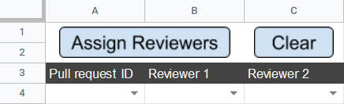

# Individual Pull Request Tool

This tool consists of a [Google Sheets file](https://docs.google.com/spreadsheets/d/1-sXJVpQ2t_tSH6aG8B6KGxP1lkA2jufn4xXiq2vq_og/edit?usp=sharing),
and accompanying Google Scripts. The sheets involved are:

- _Individual pull request_
- _Pull requests overview_
- _Reviewers_

## Purpose

This tool is used for assigning specific reviewers to a specific pull request.
This might be necessary in cases where multiple issues are linked.

## Setup

This tool requires that the _Pull requests overview_ tool is in use, and has updated
its accompanying sheet. Following this, it is possible to select any active pull
request in the _Individual pull request_ sheet.

The _Reviewers_ sheet must contain the GitHub account names of all members of the
current GIRAF team. This data can be filled in with the _Update_ button at the
top of the sheet.

## Usage

This tool is used by selecting the specific pull request and reviewers with the
dropdowns in the _Individual pull request_ sheet. They are then assigned as reviewers
by pressing the _Assign Reviewers_ button which has the `assignReviewersToPullRequest`
script assigned to it, which is found in the `IndividualPullRequest.gs` file. 
The selection can then be cleared by pressing the _Clear_ button which has the
`clearIndividualPullRequestSheet` script assigned to it, which is found in the
`IndividualPullRequest.gs` file.

