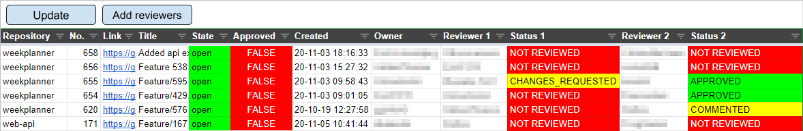

# Pull Requests Overview Tool

This tool consists of a [Google Sheets file](https://docs.google.com/spreadsheets/d/1-sXJVpQ2t_tSH6aG8B6KGxP1lkA2jufn4xXiq2vq_og/edit?usp=sharing),
and accompanying Google Scripts. The sheets involved are:

- _Pull requests overview_
- _GitHub teams_
- _Reviewers_
- _Unavailable reviewers_

## Purpose

This tool is meant to give an overview of all active pull requests in the GIRAF
GitHub repositories.
It is also used to assign reviewers to pull requests, and to post the checklists
found [here](../../../Review_Checklists/2020E/index.md) alongside them.

## Setup

The tool needs to be setup with data about the current GIRAF team in order to function.
The data is entered into some of the sheets, and the Google Scripts found at
`Tools>Script Editor` in the menus bar.

The _GitHub teams_ sheet must contain data about the current GIRAF team groups
and their roles regarding process and PO.

The _Reviewers_ sheet must contain the GitHub account names of all members of the current GIRAF team.
This data can be filled in with the _Update_ button at the top of the sheet.

The _Unavailable reviewers_ sheet must contain the GitHub account names of any members
who are currently unavailable. They will be exempt from being assigned as reviewers
as long as they are listed here.

In the `API.gs` file found with the script editor, the `SEMESTER_START_DATE` needs
to be updated to the start date of the current GIRAF team's semester. In the same
file, the `ACCESS_TOKEN` needs to be updated with a GitHub access token from one
of the team members. An access token can be generated [here](https://github.com/settings/tokens).

## Usage

The tool is used with the two buttons in the _Pull request overview_ sheet.

The _Update_ button updates the overview with information about active pull requests. 
It has the `getPullRequestsOverview` script assigned to it, which is found in the
`PullRequestOverview.gs` file.

The _Add Reviewers_ button adds reviewers to the pull requests that currently have
no reviewers assigned. It has the `addReviewersToPullRequests` script assigned
to it, which is found in the `PullRequestOverview.gs` file.

