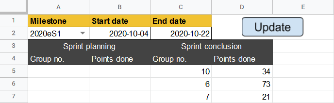

# Sprint Points Tool

This tool consists of a [Google Sheets file](https://docs.google.com/spreadsheets/d/1-sXJVpQ2t_tSH6aG8B6KGxP1lkA2jufn4xXiq2vq_og/edit?usp=sharing),
and accompanying Google Scripts. The sheets involved are:

- _Sprint points_
- _Milestones_

## Purpose

This tool is meant to give a quick overlook over how many story points have been completed during a sprint.
The sprint is represented by a milestone, and start and end dates.

## Setup

The tool needs to be setup with data about the current GIRAF team in order to function.
The data is entered into some of the sheets, and the Google Scripts found at `Tools>Script Editor` in the menus bar.

The _Milestones_ sheet must contain any milestones used for issues by the GIRAF team on GitHub.
These milestones are meant to represent the individual sprints.

In the `API.gs` file found with the script editor, the `SEMESTER_START_DATE` needs to be updated to the start date of
the current GIRAF teams semester.
In the same file, the `ACCESS_TOKEN` needs to be updated with a GitHub access token from one of the team members.
An access token can be generated [here](https://github.com/settings/tokens).

## Usage

The tool is used with the _Sprint points_ sheet, where the information about point completion is also shown.
The milestone, start, and end dates are input, and then the Update button is pressed to fill in the sheet.
The Update button has the `getIssuesSprintConclusion` function assigned, which can be found in the `SprintPoints.gs` file.

