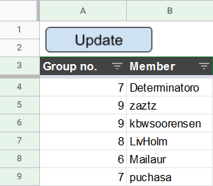

# Sprint Retrospective Tool

This tool consists of a [Google Sheets file](https://docs.google.com/spreadsheets/d/1-sXJVpQ2t_tSH6aG8B6KGxP1lkA2jufn4xXiq2vq_og/edit?usp=sharing),
and accompanying Google Scripts. The sheets involved are:

- _Sprint retrospective_

## Purpose

This tool is meant to randomly distribute Process group members as interviewers for the other groups during sprint
retrospective.

## Setup

The tool needs to be setup with data about the current GIRAF team in order to function.
The data is entered into some of the sheets, and the Google Scripts found at `Tools>Script Editor` in the menus bar.

In the `API.gs` file found with the script editor, the `SEMESTER_START_DATE` needs to be updated to the start date of
the current GIRAF teams semester.
In the same file, the `ACCESS_TOKEN` needs to be updated with a GitHub access token from one of the team members.
An access token can be generated [here](https://github.com/settings/tokens).

## Usage

The tool is used with the _Sprint retrospective_ sheet by pressing the _Update_ button.
This button has been assigned the `dividePGMembersBetweenGroups` script from the `SprintRetrospective.gs` file.

