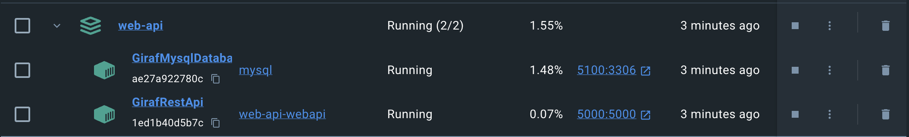
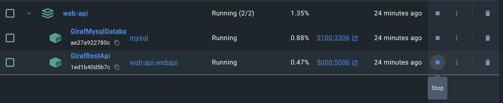
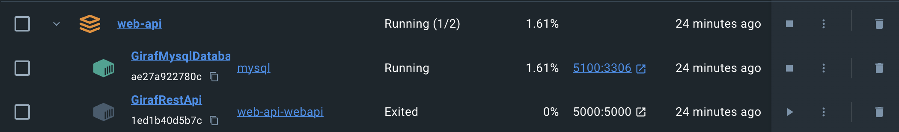

# Optional: Dockerisation

## Running the web-API with Docker

Start by downloading the Docker, this can be either the Docker Engine itself (this requires more knowledge of Docker), or the easier alternative Docker Desktop (Linux, MacOS and Windows) [Download Docker Desktop](https://www.docker.com/get-started/).

Ensure that you cloned the web-API repository from this section [Clone the web-API](#clone-the-web-api-repository).

In your terminal navigate to the cloned web-API folder on your local machine.

In the terminal you can run one of 2 commands:

1. `docker compose up`
2. `docker compose up -d`

The first command runs the docker compose from the terminal and effectively occupying the terminal. This can be avoided using the second command as this runs the docker compose in detached mode, such that the terminal can still be used for other things.

Open Docker Desktop and confirm the application is running:

You are now able to use the API, which is located on http://localhost:5000.

### Local Development with Docker(Optional)

First follow the steps in [Running the web-API with Docker](#running-the-web-api-with-docker).

Next shutdown the web-api container within the application, in docker desktop this can be done, by clicking the stop icon.

Shown here:

After doing that they api should have stopped and you should see the following:

Last step is to open your IDE, locate the `LocalDocker.AppSettings.json` file in the GirafAPI project. Copy the connection string and paste it into the `Development.AppSettings.json` connection string, **if you copy the connection string** make sure to change the server to localhost, and change the port to 5100.

Another approach would be to change the launchsettings, specifically the ASPNETCORE_ENVIRONMENT to `LocalDocker`

Now you should be able to develop in your IDE, run the API directly in the IDE, and utilize the Docker MySQL container.
