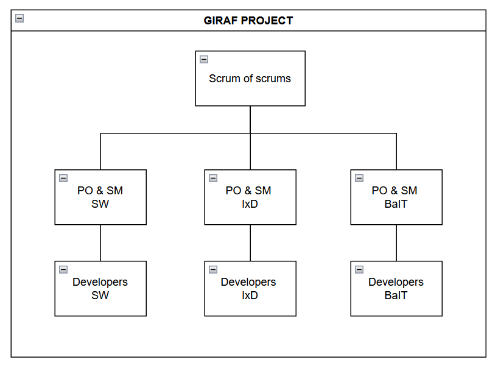

# Roles

GIRAF uses a Scrum of Scrums structure where each project group has a Product Owner (PO) and Scrum Master (SM), with the remaining members as developers.

Each group sends their PO and SM to cross-group meetings, forming PO and SM groups that govern the overall project. These representatives then communicate decisions back to their teams, ensuring all GIRAF participants stay aligned.

> **Note:** Roles can be fixed for the semester or rotated so every student experiences each role. Rotation requires good communication and thorough handover notes.

## Product Owner (PO)

The PO group maintains the connection between GIRAF and its stakeholders.

**Responsibilities:**

- Maintain contact with stakeholders (institutions, users)
- Manage the Product Backlog
- Create and refine issues
- Create prototypes when needed for issues
- Design and conduct usability tests
- Maintain design guidelines
- Collaborate with SM group to decide Sprint Backlog contents
- Add release descriptions to the wiki
- Can work on development issues if capacity allows

## Scrum Master (SM)

The SM group administers the process and ensures Scrum practices are followed.

**Responsibilities:**

- Maintain and improve team processes
- Plan and schedule sprint events (location, time)
- Moderate sprint events
- Distribute issues from GitHub to teams
- Assign reviewers to pull requests
- Collaborate with PO group to decide Sprint Backlog contents
- Can work on development issues if capacity allows

## Developer (DEV)

Developers form the core of each project group.

**Responsibilities:**

- Work on assigned issues
- Create new issues when bugs or improvements are discovered
- Review pull requests — **this is always the highest priority**
- Participate in sprint events
- Communicate blockers to SM

## Cross-Group Communication

Groups are encouraged to share knowledge directly, but the formal responsibility for keeping everyone informed lies with the PO and SM representatives. Key communication channels:

- **Discord** — Day-to-day questions and updates
- **Sprint Planning** — Process changes and sprint goals announced
- **Sprint Review** — Cross-team demos and feedback
- **Sprint Retrospective** — Process improvements identified
