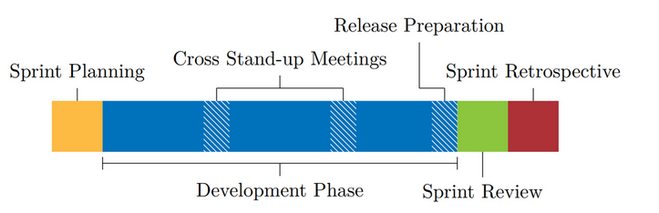

# Sprint Events

GIRAF uses 2-week sprints. This page covers all sprint events in the order they occur.

For the official Scrum definitions, see the [Scrum Guide](https://scrumguides.org/scrum-guide.html).

---

## Sprint Planning

**When:** Start of each sprint
**Duration:** Max 4 hours
**Participants:** All GIRAF team members (PO, SM, and developers)

### Before Sprint Planning

1. PO and SM groups decide which issues to include in the Sprint Backlog
2. Everyone is divided into random **Cross-groups** (each has at least one PO and one SM member)
3. Issues are divided evenly between Cross-groups for estimation

### Agenda

1. **Process updates** — SM presents changes based on previous retrospective
2. **Goals** — PO presents semester goal, sprint goal, and key issues
3. **Time estimation** — Cross-groups estimate their assigned issues

### Planning Poker

Time estimation uses Planning Poker with Fibonacci cards: 1, 2, 3, 5, 8, 13, 21, 34, 55, 89, 144.

**Key:** 5 points = one 8-hour workday. Think in relative effort, not hours.

**Include in estimates:** Testing, code review, documentation, usability test design.

**Process:**

1. Everyone reads and discusses the issue
2. Everyone picks a card secretly, then reveals simultaneously
3. If estimates differ by more than two steps (e.g., 3 vs 8), discuss and re-estimate
4. After max 3 rounds, take the median

### After Sprint Planning

1. Development teams prioritize their assigned issues (High / Medium / Low)
2. SM group distributes issues, balancing:
   - Maximum high-priority issues per team
   - Minimum low-priority issues per team
   - Equal workload across teams

---

## Development Phase

**When:** After Sprint Planning until Sprint Review
**Duration:** ~2 weeks

Teams work on their assigned issues. See [Code Workflow](code_workflow.md) for the issue-to-merge process.

### Need More Work

If your team finishes early:

1. Find an issue in the Sprint Backlog
2. Ask the SM group for approval (they may redirect you to higher priorities)

---

## Sprint Review

**When:** End of sprint
**Duration:** Max 2 hours
**Participants:** All GIRAF team members and available stakeholders

### Purpose

- Teams **demonstrate completed work**
- PO group and stakeholders provide **feedback**
- Product Backlog is **updated** based on learnings

### Format

Each team presents what they accomplished. This is an opportunity for stakeholders to see progress and suggest adjustments.

---

## Sprint Retrospective

**When:** After Sprint Review
**Duration:** Max 1.5 hours
**Participants:** All team members

### Purpose

- Identify what **went well**
- Identify what **could improve**
- Create **actionable improvements** for next sprint

### Format

Each team conducts their own retrospective. The SM group aggregates insights across teams and presents process changes at the next Sprint Planning.

---

## Timeline Summary

| Day | Event |
|-----|-------|
| Sprint Day 1 | Sprint Planning (morning) |
| Days 2-13 | Development Phase |
| Sprint Day 14 | Sprint Review, then Retrospective |
