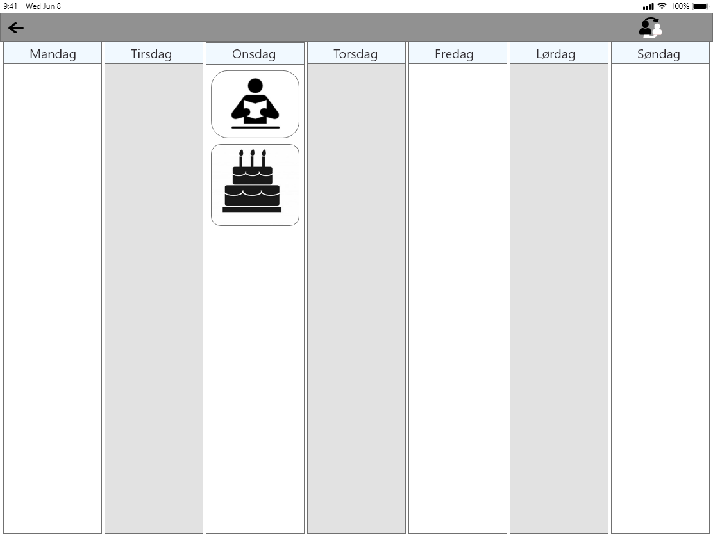
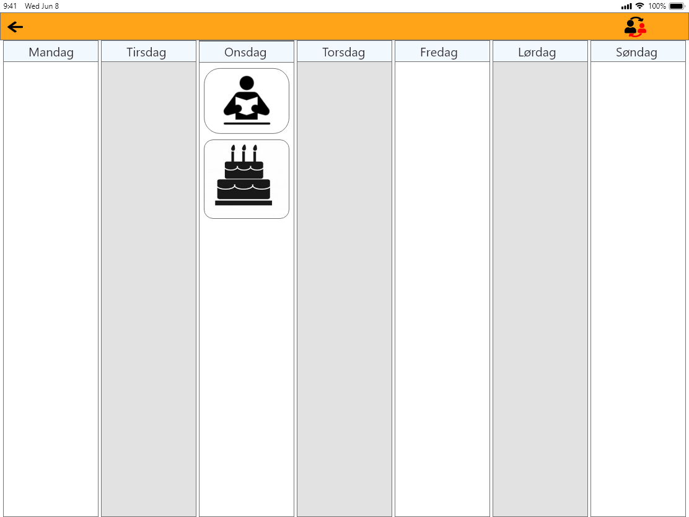

# Greyscale

A guardian should be able to change a citizen's colour scheme to greyscale if the
citizen prefers this or finds too many colours overwhelming.

The citizen should have the option to change the whole page to greyscale, or just
the weekplan such that the top bar colour still remains.

These examples are shown on the prototypes below:

<!--  -->
<!--  -->
