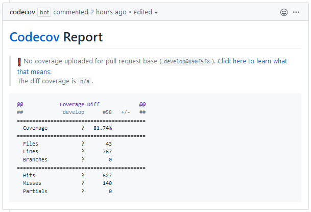

# Code Coverage

To make sure that new code is tested, we keep track of the code coverage.

To do this we use [Codecov.io](https://codecov.io/).
The Codecov page for GIRAF is: <https://codecov.io/gh/aau-giraf>.

## Usage

This section shortly explains how to use Codecov

### Codecov.io

On the [Codecov site](https://codecov.io/gh/aau-giraf), the GIRAF repositories using
Codecov can be seen. In the different repositories, multiple things can be seen.
For example, the code coverage, and changes in code coverage for every commit.

### Pull Request Comments

On every pull request, Codecov will comment on the pull request.



This comment is updated when new commits are added to the pull request.

## Setup

### GitHub Actions Workflows

#### Flutter Repositories

In Flutter repositories, the `--coverage` argument is added to the `flutter test`
step in the workflow. This generates a coverage file, which is then uploaded by
the next step:

```yaml
...
- run: flutter test --coverage
  name: Tests
- name: Upload coverage to Codecov
  uses: codecov/codecov-action@v1
...
```

#### .NET Repositories

In the .NET repositories, the package `coverlet.msbuild` is used to generate code
coverage reports. The package is installed with in `GirafRest.Test`.

Then in the workflow, in the test step, some arguments are added.

```yaml
- name: Test
  run: dotnet test /p:CollectCoverage=true /p:CoverletOutputFormat=lcov /p:ExcludeByFile=\"**/Migrations/**/*\"
- name: Upload coverage to Codecov
  uses: codecov/codecov-action@v1.0.6
```

Beneath is an explanation of the arguments:

```
- /p:CollectCoverage=true                   | enables code coverage collection
- /p:CoverletOutputFormat=lcov              | sets the format of the report to lcov, which can be used by codecov
- /p:ExcludeByFile=\"**/Migrations/**/*\"   | excludes the Migrations folder from the report

```

### Config

The codecov integration is configured in the `codecov.yml` file in the respective
repositories. Documentation for the config file can be seen at <https://docs.codecov.io/docs/codecov-yaml>.

## Affected Repositories

Right now codecov is used in:

- [weekplanner](https://github.com/aau-giraf/weekplanner)
    - [](https://codecov.io/gh/aau-giraf/weekplanner)
- [api_client](https://github.com/aau-giraf/api_client)
    - [](https://codecov.io/gh/aau-giraf/api_client)
- [web-api](https://github.com/aau-giraf/web-api)
    - [](https://codecov.io/gh/aau-giraf/web-api)