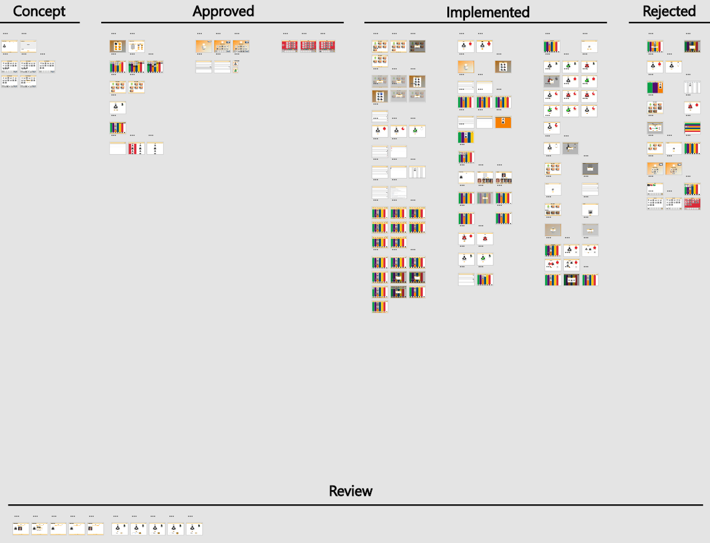
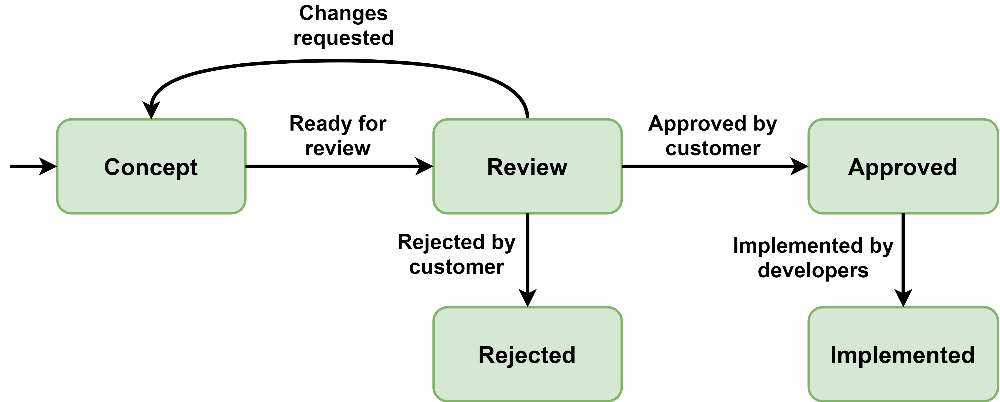
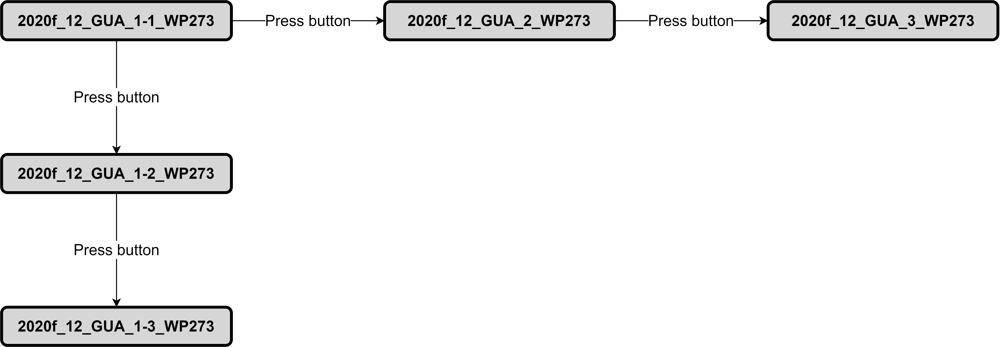

# Prototype Administration System
The system described here was defined by the PO group of the spring semester 2020. A more detailed description is available in their report. The prototype administration system was created to keep track of the prototypes' state and its context.

## Workspace Organisation

The workspace in Adobe XD has been divided to categorize prototypes based on their state as shown by the image below:

The figure below describes how the prototype transistions between the states:

The table below gives a short description of each state:

| **State**   | **Description**                                                                                                           |
|-------------|---------------------------------------------------------------------------------------------------------------------------|
| Concept     | Prototype is in development (either because it has just been created or because changes were requested by the customers). |
| Review      | Prototype is ready to be reviewed by customers.                                                                           |
| Approved    | Prototype has been reviewed and approved by customers.                                                                    |
| Implemented | Prototype has been implemented.                                                                                           |
| Rejected    | Prototype has been reviewed and rejected by customers.                                                                    |

## Naming Convention

The format of prototype names is defined as:

**yyyyx_ContextID_CompareID_ViewID_RelateID_GitID**

The table below describes each part of the name:

| **Part**  | **Description** |
|-----------|-----------------|
| yyyyx     | *yyyy* is the year and *x* is the semester (*f* represents spring and *e* represents fall). Prototypes made during the spring semester of 2020 are named *2020f*. |
| ContextID | An integer that is unique for the semester and represents the context of the prototypes. E.g. if four prototypes have been created to illustrate the feature of deleting pictograms, they should have the same *ContextID*. |
| CompareID | If some prototypes illustrate one way to implement a feature while others illustrate a different way to implement the same feature (they should share *ContextID*) and they are being compared at the customer review, they should be given a letter (*A*, *B*, *C* etc.). |
| ViewID    | Either *GUA* or *CIT* depending whether the prototype illustrates guardians view or citizen's view. Should always be included. |
| RelateID  | One or more integers (if there are more they should be seperated by hyphens) that describe how prototypes with the same *yyyyx*, *ContextID*, *CompareID* and *ViewID* are related. If the name is already unique without *RelateID* it should be exluded |
| GitID     | The GitHub issue that the prototype is related to. Use abbreviations so WP273 = weekplanner#273 and PR12 = pictogram-reader#12 |

The naming convention is illustrated by the figure below:

*Press button* indicates that a button, text field or similar on one prototype leads to another. E.g. pressing one button on 2020f_12_GUA_1-1_WP273 leads to 2020f_12_GUA_2_WP273 while pressing another leads to 2020f_12_GUA_1-2_WP273. But there is no button on 2020f_12_GUA_1-2_WP273 that leads to 2020f_12_GUA_2_WP273.
