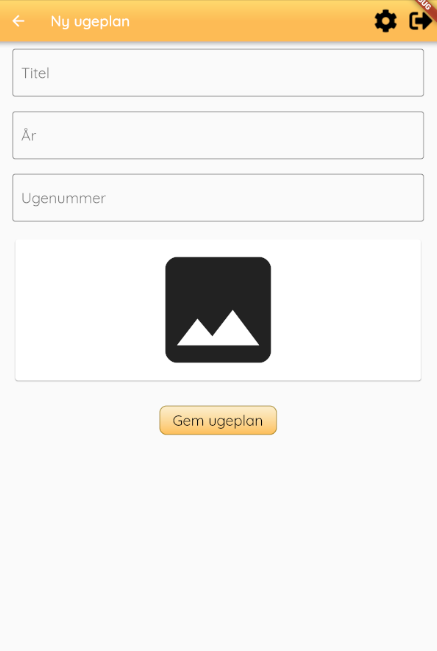
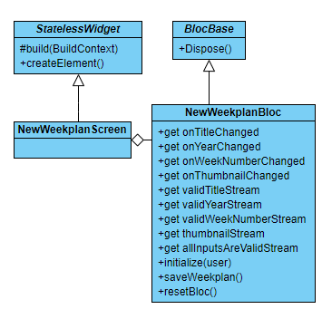

# new_weekplan_screen.dart

## Functionality
The `new_weekplan_screen` is the screen from which you can add a new weekplan. When adding a new weekplan it is necessary to specify a correct title, year, and week number.
The information has to be valid, thus it must have a title, the year must be of four digits, and the weeknumber between 1 and 53. 

The screen also allows for choosing a thumbnail for the weekplan.

## Layout
The screen's layout:

## Buttons
As of now, only one button of the two is seen in the layout, is clickable. The disabled button `"Vælg skabelon"` can be implemented later, and should allow a guardian to use a predefined template. The enabled button `"Gem ugeplan"` is used to save he weekplan.

## Code
The most relevant function is the `build` function. The function returns a `scaffold` containing a `listview` with three streambuilders.
Each `streambuilder` uses either `_bloc.validTitleStream`, `_bloc.validYearStream` or `_bloc.validWeekNumberStream` to get information about the validity of the inputs given by the user. 

## Structure

