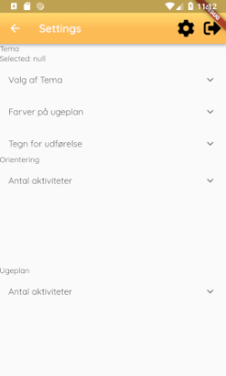
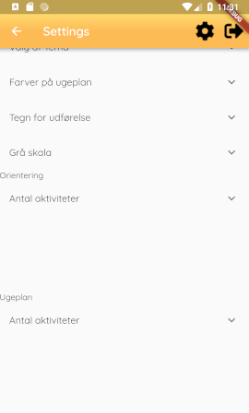
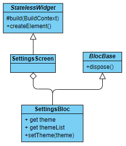

# SettingsScreen

This file documents the SettingsScreen class.

## Functionality

The SettingsScreen is work in progress.
At the moment, there is not much interesting functionality to report.

## Layout

This is the layout of the screen. 

For now, this is only a skeleton of what the settings screen will be one day.
So far, there are six drop down menus that do nothing.
The first one is for choosing a theme for the app.
There are a few choices to choose from, but they have not been implemented.
The second one is for the colors of the week plans. Right now, the weekdays have a color based on an international standard, but that can be changed here.
The third one is for the mark for completing an activity.
If the user does not like the tick mark that is used by default, they can change it here.
There is a hidden fourth menu if the user scrolls down when the curser is amongst the top three menus. 
 
This fourth menu is for grey scale settings.
Some of the citizens cannot cope with overstimulation, which is why this setting is here.
The fifth menu and sixth menus do not have a purpose yet.
None of these menus actually change anything, so they are all useless.

## Buttons

Pressing the drop down menu headlines makes the drop down menus drop down.
This reveals the different choices that the user of the screen can use, but pressing them does not do anything.
One exception is the first menu, which sets a field in the settings screen class, but it is not used anywhere.

Pressing the settings button in the top opens another settings screen.
Users can open infinitely many settings screens this way, and they will have to close all of them individually with the back button, or log out.

## Code

The settings screen class has a few methods for building the UI for the screen, and that is pretty much it.

## Structure

This is the class diagram for the settings screen.  
