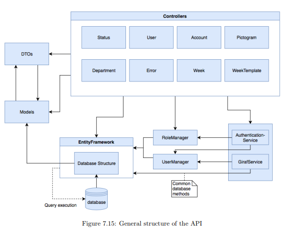
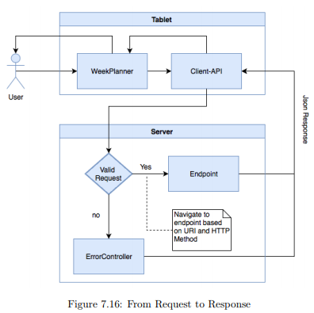
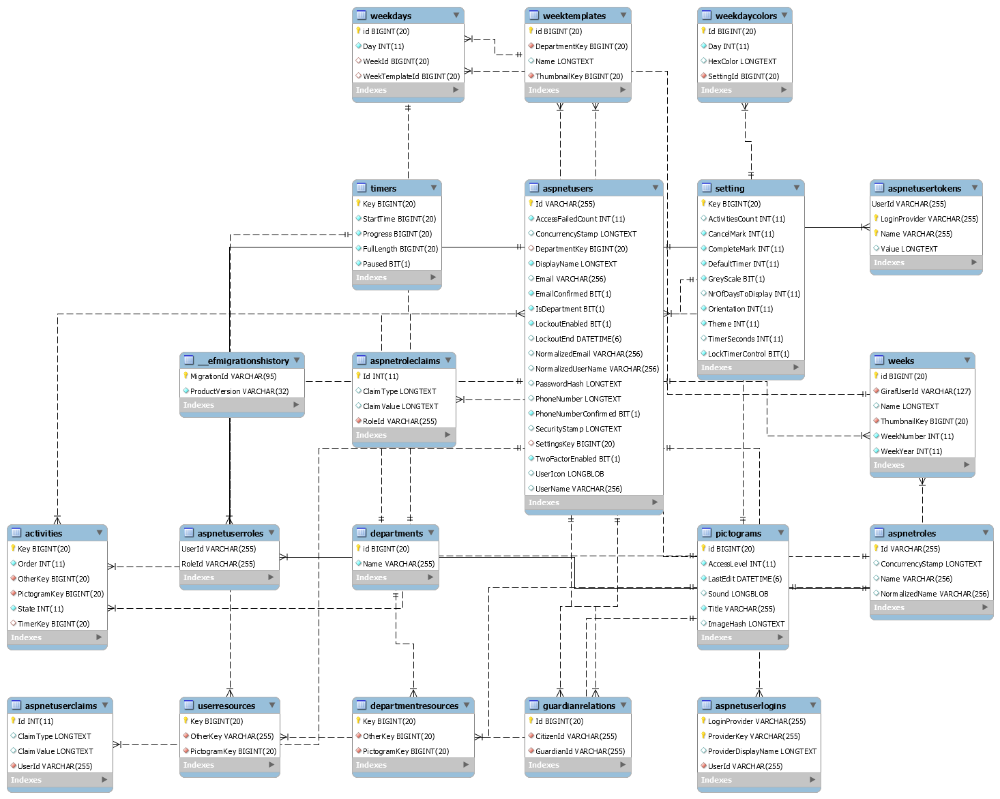

# Backend Arkitektur

## Code Base



This figure gives an general overview of the API structure.
In the illustration an arrow indicate that a component pointed by is dependent of the component that is pointed to.
The dashed line from Entity Framework to the database indicates that Entity Framework is responsible for executing queries on the database.

As illustrated in the figure, there are eight controllers in the web API which are responsible for handling all requests to the API.
The controller uses the DTOs to define the JSON structure for the objects in the HTTP message body, which in turn are a subset of the ```Model``` classes.
To extract information from the database the controllers uses Entity Framework which executes queries to the database.

To extract and store data through Entity Framework the ```Controllers``` use the ```Model``` classes.
The controllers also use services to make authentication checks and other common functionality like retrieving user data from the database.

## Making a Request



This figure shows how a request from the user is translated into a JSON response given the current architecture of the backend.

First, the WeekPlanner will use the generated client-API to make an HTTP request to the server.
On the server the HTTP request is validated with the purpose of checking whether or not there is a matching URI and HTTP method; if no match is found the request is redirected to the ```ErrorController``` which sends an error response as JSON back to the WeekPlanner application to notify the user of this error.

If there is a match, the relevant method is called, which uses the information in the HTTP body and header to produce a JSON response, which depending on the request might be a success or error.

To see which method is called, consider the request ```GET http://web.giraf.cs.aau.dk:5000/v1/Pictogram/2/image```.

All controller classes are in the folder ```⋯/GirafRest/Controllers/```, and in this case the request is route to the ```PictogramController```, because ```/v1/Pictogram``` matches its Route attribute:

```Csharp
[Route("v1/[controller]")]
[Authorize]
public class PictogramController : Controller {...}
```

This controller contains the method

```Csharp
[HttpGet("{id}/image")]
public async Task<Response<byte[]>> ReadPictogramImage(long id) {...}
```

whose attribute matches the ```GET``` verb and the last part of the URI, ```/2/image```.

## The Database



As the figure illustrates, we use the ASP.NET Identity membership system to manage ```Users```.
Each user with the citizen role, has a relation to a ```Settings``` entity which defines configurations specific to a ```User``` which can be set in the WeekPlanner application. Furthermore a ```User``` has a reference to private ```Pictograms``` through the ```UserResources``` which is the pivot table for describing a many-to-many relationship between ```Users``` and ```Pictograms```.

A ```User``` is also part of a ```Department``` and has a list of weekschedules which is modelled with the ```Weeks``` entity. A ```Week``` has a reference to up to seven ```Weekdays``` where each day contains an ```Activity``` which has a reference to a ```Pictogram```, an order, and a state.
An ```Activity``` is thus a ```Pictogram``` that is related to a specific ```WeekDay``` in a ```Week``` and has an order which indicates the index of the ```Activity``` in the ```Week``` and a state which for instance can take the values "checked" and "current".

A ```WeekTemplate``` is a generic form of ```Week```, but unlike ```Week```, the entity does not have a year and week-number and instead of belonging to a ```User``` it belongs to a ```Department```.

```Departments``` like ```Users``` can also own ```Pictograms``` which is modelled through the ```DepartmentResources``` entity.

## Next

We end the development stuff with [A List of the Controller Classes](./EndpointsAndControllers.md).
