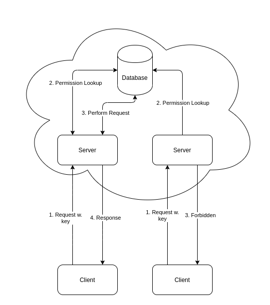
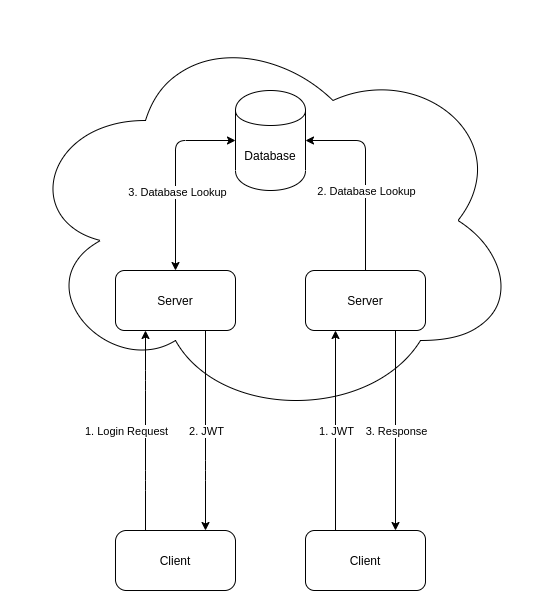

# Token Authentication

For authenticating users we [JWT token authentication](https://jwt.io), meaning that the user of the REST API must send a bearer token in the header whenever making requests to endpoints that require authentication.

For instance consider a login request:

```bash
curl -X POST "http://localhost:5000/v1/Account/login" -H "accept: text/plain" -H "Content-Type: application/json-patch+json" -d "{ \"username\": \"<yourUserName>\", \"password\": \"<youPassword>\"}"
```
This login request will return a token.

One can then set the token in the authentication header: ```Authorization: Bearer <token>```

For examples of how to do this in swagger see the README file at the [web-api repository](https://github.com/aau-giraf/web-api).

## What is a JWT?

JSON Web Token is an authentication token, which actually contains user information, as opposed to API keys. Traditionally api keys can be a GUID or a nonsense string, which is really a primarykey in a database, when supplied in the header of an HTTP request, the backend will then make an appropriate lookup across tables or with its authentication service to ascertain the rights of the user in question, if any. A JWT works differently: It actually contains serialized information about the user, and their access rights, this has the advantage of saving the service from database lookups, to obtain the information. It also contains a timstamp, by which the service can determine whether it is still valid.
|Classic API Key Auth|JWT API Auth|
|-|-|
|  |  |

## How does JWT work?

If a JWT contains user information, or information about access rights, it may seem insecure. But this is not the case, in fact, it works much in the same way as RSA certificates, and can in fact use RSA or an algoritm called HMAC. On an abstract level it works like this:

### Token creation

 1. A login is attempted at the server, e.g. with username and password
 2. The server verifies the information, and creates a json object containing the relevant information
 3. The server then SIGNS the information, and serializes it.
 4. Finally the object is returned to the user.

From this point onward, there are two posibilities of what happens when a user tries to log back in:

### Client access via Token

1. The client sends the JWT to the server
2. The server verifies the signature, resulting in one of two things:
    - Allows the client to do whatever the JWT says he or she is allowed to do
    - Verification fails, and the JWT is discarded, the client is then typically presented with HTTP 403 or similar, if the client has a gui, the user can redirected to a login page, or the credentials are cached, and the token is refreshed.

### What happens when user rights, etc. are altered?

One of the weaknesses of the JWT is that since it is signed by an authority, the information in it is valid until the signature (timestamp etc.) determines it is no longer so, or at least until it is checked against the database next time. This means that rights may be changed serverside by an administrator, but it may take until the whatever the refresh rate set by the server is, to deny the client the right to some action which has now been denied them.