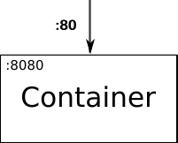
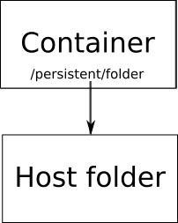

# Docker
[Docker](https://en.wikipedia.org/wiki/Docker_\(software\) "wikilink")
is a tool for managing software containers. A container is used to
isolate software from the system it runs on. It encapsulates some
software and all necessary dependencies for running it, which guarantees
that no matter which environment is used, the application running inside
the container will still function the same. The software can be run on
any platform that supports the container solution. Bear in mind we don't
want to use Docker directly, we use it as a part of Kubernetes, but
because of time restrictions we deployed our REST API, MySQL database,
Jenkins and Artifactory with Dockerfiles. In addition, we use
Dockerfiles as the recipes for running the build notes in the continuous
integration pipeline. Each Dockerfile contains all necessary commands
that is required to build, test and export the projects, and the
resulting image from running the Dockerfile is then discarded. Docker
containers are generated from Docker images, which act like a template
for the creation of a container. The images can be created from files
called Dockerfiles, acting like a recipe for creating the templates. A
Dockerfile specifies what software and dependencies a Docker image
should contain.

## Dockerfiles

Docker uses its own scripting language for creating Dockerfiles, running 
commands from top to bottom. Below we show our example of a Dockerfile
for deploying Jenkins. (Please note, that as of 2018, the Jenkins CI
server has been replaced by the GitLab CI server, and as such the
following example is only used in this article.)

```docker FROM jenkins:latest RUN /usr/local/bin/install-plugins.sh google-oauth-plugin android-emulator android-lint oauth-credentials
git-client artifactory cas-plugin checkstyle git
google-play-android-publisher postbuild-task gradle javadoc junit
repository

USER root RUN apt-get update RUN apt-get install -y curl libunwind8
gettext RUN curl -sSL -o dotnet.tar.gz
<https://go.microsoft.com/fwlink/?linkid=847105> RUN mkdir -p
/opt/dotnet RUN tar zxf dotnet.tar.gz -C /opt/dotnet RUN ln -s
/opt/dotnet/dotnet /usr/bin/dotnet RUN rm dotnet.tar.gz

ENV ANDROID\_SDK\_URL
<https://dl.google.com/android/repository/tools_r25.2.3-linux.zip>

RUN cd /opt && curl -o tools.zip $ANDROID\_SDK\_URL RUN cd /opt && unzip
tools.zip COPY intel-android-extra-license
/opt/tools/licenses/intel-android-extra-license COPY android-sdk-license
/opt/tools/licenses/android-sdk-license COPY jobs
/var/jenkins\_home/jobs

ENV ANDROID\_HOME /opt/tools ENV PATH $PATH:$ANDROID\_HOME/

RUN echo y | android update sdk --no-ui

COPY config.xml /var/jenkins\_home/config.xml

```

The Dockerfile commands in our Dockerfile for deploying Jenkins are as
follows:

- **FROM** indicates which existing Dockerfile we want to use and
extend. Our Dockerfile extends the official Dockerfile for Jenkins
through this command. 
- **ENV** sets an enviroment variable. For
instance in this case //ANDROID\_SDK\_URL// is set to the location for
the Android SDK. Setting these enviroment variables improves the
readability, like using variables in other software. 
- **USER** sets
the user being used to run the commands following it. That user is used
until it's changed by another //USER// command. 
- **RUN** executes
shell commands inside the container. For instance in this case it's
being used to download the Android SDK, and later execute the Android
SDK.
- **COPY** can be used to copy external files into the Docker
image being created. In this case it's being used to copy a
configuration file for Jenkins into the image so we are guaranteed to
always have the same configuration when deploying.

You may notice that the first command refers to another Dockerfile,
which our Dockerfile then extends upon (in this case the official
Dockerfile for Jenkins). The Jenkins Dockerfile contains some commands
we explain below, along with some other, relevant Dockerfile commands,
which we use in other files than the ones shown. Commands are as
follows:

- **VOLUME** is used to make persistent storage for the Docker
containers. It takes one parameter which is the absolute path inside a
container that should be persisted even if the container is deleted.
This is necessary if data needs to be persisted as Docker doesn't do it
by default. 
- **EXPOSE** is used to expose ports internally in a
container, as the application running in the container can only
communicate through an exposed port to the outside. This command takes a
list of ports that should be exposed. How this can be used is explained
further below. 
- **ENTRYPOINT** is used to specify what command
should be used when deploying the Docker container from an image. It
takes an array of strings where each string is a part of the complete
shell command being executed when deployed. The entrypoint commands can
never be overwritten when deploying, so it is used for executing the
minimum required commands to deploy. 
- **CMD** is also used to
specify what command or parameters that should be used when deploying.
But contrary to the entrypoint, this command can be overwritten. So this
command should be used for default parameters that should be possible to
overwrite.

## Deploying Images

When a Dockerfile has been made, you can build an image from it by
running "*docker build ./*". This assumes the Dockerfile is called
*Dockerfile*. For instance our Jenkins Dockerfile was built by using
*"docker build -t jenkins\_giraf ./"*. The *-t* parameter is used
for tagging an image, so in this case we are giving the image the tag
*jenkins\_giraf*.

When an image has been created, it's possible to deploy an instance of
it with the *docker run* command. The *docker run* command needs
atleast one parameter which is the tag of the image that should be run.
For example if we wanted to deploy our Jenkins image, we would execute
*docker run jenkins\_giraf*. This only creates a Jenkins container, it
cannot communicate with the outside system yet.

It's possible to pass a *-p* parameter that takes a port route, which
means the command could look like *docker run -p 80:8080
jenkins\_giraf*. Here the port the container listens on, the exposed
port, is port 8080. By using the parameter *-p 80:8080* we tell Docker
that the host should be redirected from port 80 to the exposed port
8080. The picture below illustrates how this
works:



we illustrate how the *-v* parameter works. This parameter is used to mount a host folder into a folder in the container. For instance this could be used when we want to populate a folder in our container with pre-existing data. The parameter is used as *-p /hostfolder:/persistent/folder* where *hostfolder* is the folder on the host system and */persistent/folder* is an arbitrary path to an existing folder inside a container. The picture below illustrates how this works:


