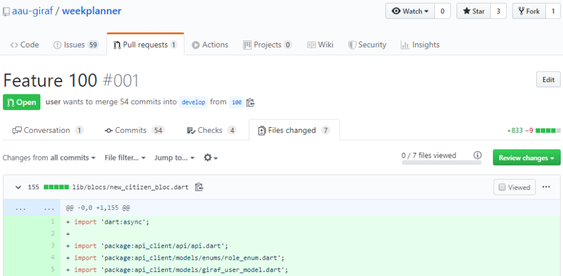

# Use of Github in GIRAF

As explained in [the process manual of 2019](../2019/changing_the_process.md#github), they changed from GitLab to GitHub.

This article will explain how GitHub is used in the 2020 GIRAF project.

## Issues

Issues are created by the development teams as well as the PO group.
An issue can be a bug report or a task creation request.

The PO group prioritises, assigns and adds milestones to issues.

The list of issues can be seen at each repository, eg. <https://github.com/aau-giraf/weekplanner/issues>
, or a [complete list](https://github.com/issues?q=is%3Aopen+is%3Aissue+archived%3Afalse+user%3Aaau-giraf) for the whole organization.

### Getting an Issue to Work on

If you have time to work on a new issue, you can get a new one by following these steps:

1. Find an issue you want to work on
2. Ask the PO group if you can work on that issue
    - The PO group might say no for various reasons.
    - There is usually a greater chance of getting a yes if the issue you've picked is either _highest_ or _high_ priority.

If you don't have a preferred issue you can ask the PO group to be assigned the most pressing issue, as they have a good overview of the project, they will most likely have some issues that they would love to have you work on.

## Branches and Pull Requests

We follow the [GitFlow Workflow](https://www.atlassian.com/git/tutorials/comparing-workflows/gitflow-workflow) as explained in [the process manual of 2019](../2019/process_group_information.md#our-adaptation-of-gitflow).

During the sprints, all development is done in feature branches, branching out from the `develop` branch.


The **naming convention** for feature branches is `feature/xx` where `xx` is replaced by the issue number.

When the [Release Preparation](./giraf_events.md#release-preparation) phase begins,
a release branch is created from the `develop` branch.
This branch is now used **instead** of `develop` until the sprint is over.

The **naming conventio**n for release branches is `release/YYYYsXrZ` where `YYYY` is replaced by year, `X` with the sprint number and `Z` with the release number.

E.g. `2020s1r1` for 2020, sprint 1, release 1.

### Creating a Branch

#### During Sprints

When you start working on an issue, you create a branch from `develop` called `feature/xx` where `xx` is the issue number.

From the terminal:

```bash
git checkout develop
git checkout -b feature/xx
```

Or from GitHub:

1. Make sure `develop` is selected.

    
   
2. Input the name of the branch (e.g. for feature 400).

    

3. Press "Create branch: feature/xx from 'develop'"

#### During Release Preparation

When you start working on a release fix, you create a branch from `release/*` called `releaseFix/xx` where `xx` is the issue number.

```bash
git checkout release/*
git checkout -b releaseFix/xx
```

Or from GitHub using the same procedure as above, **but** with the release branch as base instead, and with the release fix naming convention.

### Creating a Pull Request

When you have finished your issue, it is time to create a pull request.
A pull request is a request to merge your branch into another branch.

Creating a pull request on GitHub:

1. Open the "Pull requests" tab in the repository (e.g. <https://github.com/aau-giraf/weekplanner/pulls>)
2. Press "New pull request"
3. Select the appropriate branch as base.
    * `develop` if during sprint
    * `release/*` if during release preparation
4. Select your branch for as compare
5. Press "Create pull request" 
6. Name the pull request `Feature xx` or `Feature xx: A title describing changes`
7. Write a description
    * If you write `closes #xx` or `fixes #xx`, issue xx will be linked to the PR and will close when the PR is merged. ([All keywords](https://help.github.com/en/enterprise/2.16/user/github/managing-your-work-on-github/closing-issues-using-keywords#about-issue-references))


## Code Review

After being assigned a pull request, the group should review the code under the _Files changed_ tab. Look for code that may be deprecated, unnecessary, optimizable or has weird formatting. 

Start at <https://github.com/aau-giraf/>

1. Choose repository eg. weekplanner.
2. Click on the **Pull Request** tab.
3. Choose a open pull request from the list.
4. Click on the **Files Changed Tab**. All the changes can be seen in these files.
   
    1. Make a comment or suggestion on a single line or multiple lines by pressing the blue + icon. 
    The red circle marks the selection icon which can be used to suggest code that replaces the line(s).
      
    You can view what the author will see by clicking **Preview**.
    
5. Having looked over all the files, click **Review changes**.
    1. If you made comments, make sure the author looks them through by choosing **Request changes** before clicking **Submit review**. If changes are made, you have to re-review the pull request!
    
    2. If the changes makes sense, click **Approve**.
    


