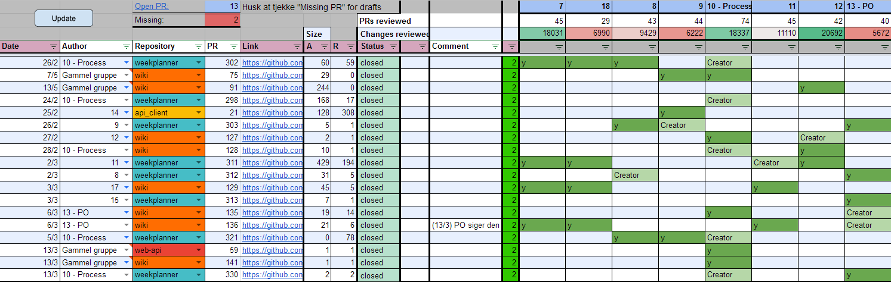

# Process Group Tools

## Review Sheet

In order to keep track of who should review what, we created a review sheet based on the [2019 process group](../2019/process_group_information.md#assigning-reviewers).
Our template for the review sheet can be found [here](https://docs.google.com/spreadsheets/d/14RUJlz06PSJyribtlnhFc5Bx1vNicyDS37lcGv5jGLo/edit?usp=sharing).
Open the template, go to "File" -> "Make a copy" and save it to your own drive.

To setup the sheet script:

1. Go to "Tools" -> "Script editor".
2. If the script is already there go to step (4) 
3. If the script is not there, copy the script from [here](./assets/review_sheet.gs) and paste it in.
4. Generate an access token for the AAUGiraf GitHub account, and set token variable.

The review sheet has the following functionality:

* Load pull request information from GitHub
* Calculate line change per pull request and total for each development team
* Warn about missing pull requests, and provide an overview of them

## Review Script

In order to make it faster and easier for us to hand out reviews, we created a python script to do most of it for us.

The script has to be setup before using it.
When it is setup, it can be used to:

* tag teams on discord in the  `#review` channel, 
* add the teams as reviewers on the pull request and
* add the review checklist as a comment on the pull request.

All in one run.

The [review script can be found here](./assets/review.py)

## GitHub Webhooks

In order to keep track of what happens in the GitHub repositories, 
we created webhooks to send a message on our Discord server in a `#github` channel.
This can also be done with Slack.

We recommend making the channel opt-in (in Discord by using a role), in order to not spam the members.
A webhook can be on GitHub for each relevant repository. 
For example, for the weekplanner at: <https://github.com/aau-giraf/weekplanner/settings/hooks>