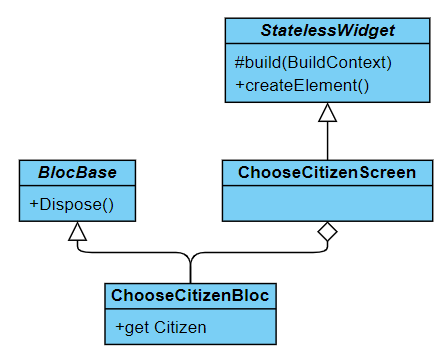

# choose_citizen_screen documentation
This file documents the choose_citizen_screen.dart file.

## Functionality
The choose_citizen_screen is the screen in the Week Planner App that shows the citizens associated with the guardian that is currently logged in. This screen is the first screen that is shown when a guardian logs on to the app.

## Layout
This is a picure of the layout of the screen <br>


The blue square is the headline "Vælg borger". It helps the user figure out what they are supposed to do when they are in that screen.

The red circle marks the logout button. We want most screens to have log out buttons, so that if a guardian needs to hand the tablet to another guardian, then the other guardian can log out and log back in from almost anywhere in the system.

The buttons that look like the one marked by the green square are called citizen buttons.
## Buttons
When the user clicks the log out button, it leads the user back to the log in screen.

When the user clicks one of the citizen buttons, the user is lead to the choose_weekplan_screen. That screen will show the week plans associated with the citizen whose picture is pressed in this screen.

## Code
Here is an excerpt from the code in choose_citizen_screen. "(...)" marks that some code has been omitted.

```Dart
/// The screen to choose a citizen
class ChooseCitizenScreen extends StatelessWidget {
  final ChooseCitizenBloc _bloc = di.getDependency<ChooseCitizenBloc>();

  @override
  Widget build(BuildContext context) {
    final Size screenSize = MediaQuery.of(context).size;

    final bool portrait =
        MediaQuery.of(context).orientation == Orientation.portrait;

    return Scaffold(
      body: Container(
        width: screenSize.width,
        height: screenSize.height,
        decoration: BoxDecoration(
          image: const DecorationImage(
            image: AssetImage('assets/login_screen_background_image.png'),
            fit: BoxFit.cover,
          ),
            (...)
        ),
      ),
    );
  }
}
```
Like most screens the ChooseCitizenScreen class extends the StatelessWidget class. It also overrides the build method. The build method builds up the screen. It checks the size and orientation of the screen to figure out how to place all the buttons in the screen.

## Structure
This is the class diagram.<br>

