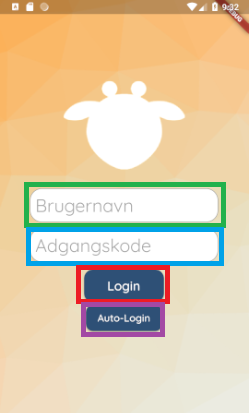
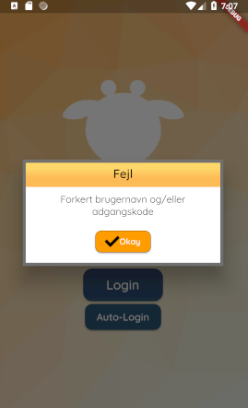

# Login Screen
This file documents the login_screen.dart file.

## Functionality
This screen is the first screen that the user sees when they open the app. It is needed to only let guardians use the app.

## Layout
This is the layout of the login screen. 

In the center of the screen is the Giraf icon.

The green square marks the username text field. The user is supposed to write their username in this text field.

The blue square marks the password text field. The user is supposed to write their password in this text field. Whatever is written in this field is hidden, to keep the password hidden from other people.

The red square marks the login button.

The purple square marks the auto-login button.
## Button
When the user clicks this button the system checks whether the username and password are valid, and either leads the user to the choose citizen screen, or gives the user a message saying that either the username or the password was wrong. 

When the user clicks this button. The content of the user name text field is changed to "graatand", the content of the password text field is changed to "password", and the functionality of the login button is run. This means that the user is able to log in to the system with one click of this button. The button is meant for quick debugging, and should not be present when the application is released.

## Code
The screen uses an AuthBLoC to keep track of which user is logged in. When the user clicks the login button, the loginAction method is called, which logs in the user if the username and password is correct. This is checked with the AuthBLoC's authenticate method. The error message is shown through the showNotifyDialog method.
