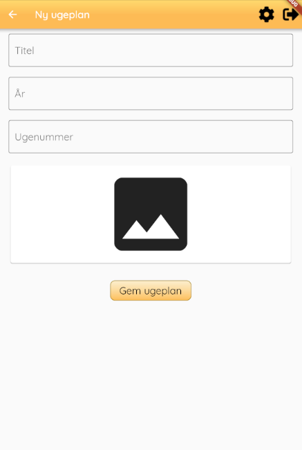
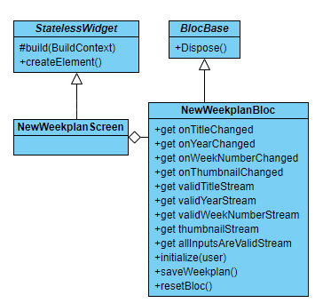

# new_weekplan_screen.md

## Functionality
The `new_weekplan_screen` is the screen from which you can add a new weeklpan. When adding a new weekplan it is necessary to specify a correct title, year and week number.
The information has to be valid, thus it must have a title, the year must be of four digits, and the weeknumber between 1 and 53. 

The screen also allows for chosing a thumbnail for the plan.

## Layout
The screen's layout

## Buttons
As of now, only one button of the two seen in the layout, is clickable. The disabled button "Vælg skabelon" can be implemented later, and should allow or a guardian to user a predefined template. The enabled button "Gem ugeplan" is used to save he weekplan.

## Code
The screen is most interesting funcion is the `build` function. The function returns a `scaffold` containing a `listview` with three streambuilders.
Each `streambuilder` used either `_bloc.validYearStream`, `_bloc.validYearStream` or `_bloc.validWeekNumberStream`. The streams are used to check validity of inputs. 

## Structure

