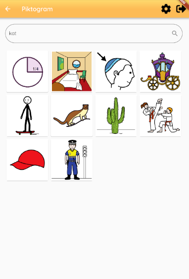

# pictogram_search_screen

## Functionality
The pictogram search screen is the one used to find a suitable pictogram when adding an activity. The screen has an input field which is used to type in a search query. The search screen will return 10 images no matter what the input query is. Thus it will match as many charcters as possible and return the images with the titles that fit the best. The search is executed whenever changes happen to the input field.

The screen has the appbar, thus from the screen you can access the settings screen or logout.
## Layout

## Buttons
All the results from the search are clickable, pressing one of the results will pop the screen and return the pressed image to the day you wanted to add it to.

## Code
The build function contains all the code for the layout, A coloumn with a textfield to enter the query. Whenever the input field is changed the search is performed through the _bloc.search stream. The column also contains another streambuilder. This streambuilder is used to check for the result of the search. If the result of the search has an error, the error message is displayed. Otherwise, while searching a circular progress indicator is displayed. 