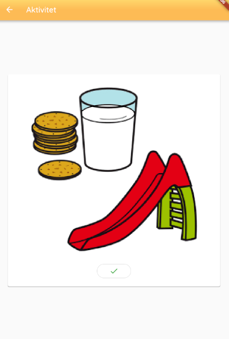

# show_activity_screen.dart

## Functionality
The `show_activity_screen` is the screen used to display a chosen activity. From the screen the user has the possibilty to mark an activity as done, or remove the mark from the activity

## Layout

## Buttons
Pressing the check mark below the pictogram either marks the activity as done or unmarks it, depending on if the acitity is already marked or not.

## Code
The primary functionality of the screen is implemented in the functions `buildActivity` and `buildButtonBar`. The `buildActivity` function uses a `streambuilder` with the `_activityBloc.activityModelStream` to get the tapped activity. The `buildActivity` function also uses a `stack` to place a check mark on top the pictogram.

The `buildButtonBar` function also uses a `streambuilder` with the same stream as `buildActivity`. The reason for this is to be able to check if the loaded activity is already marked as done, or not. The icon of the button also has to change depending on the situation, either it should be a check mark as seen in the picture shown in the layout section or an arrow, indicating a revert. 

## Structure
The structure of `show_activity_screen` is shown in this UML diagram:

