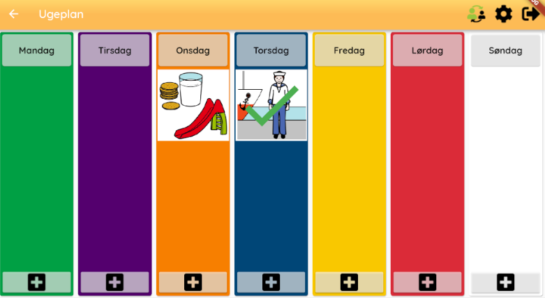

# weekplan_screen.dart
This file documents the `weekplan_screen.dart` file in the Weekplanner project.

## Functionality
The screen is the one responsible for showing all the days of the week. Each day in the weekplan_screen is displayed with all the planned activities for that single day. The colors of the days are a standard to help autistic children. From the Weekplan screen different functionality can be accessed:

* Adding activities
* Accessing an activity
* Moving activities

The weekplan screen also uses the giraf_appbar which also adds functionality

## Layout 
The weekplan screen is displayed as seen here:
 
The activity on Thursday is an activty marked as done, whereas the one on Wednesday is not done yet.

## Buttons
The buttons used in the weekplan screen are the addactivity buttons. One button is placed at the bottom of each day. 


## Code
The weekplan_screen is a widget, thus it have to implement the build function, as seen here:
```dart
@override
  Widget build(BuildContext context) {
    return StreamBuilder<WeekplanMode>(
        stream: authBloc.mode,
        builder: (BuildContext context,
            AsyncSnapshot<WeekplanMode> weekModeSnapshot) {
          return Scaffold(
            appBar: GirafAppBar(
                title: 'Ugeplan',
                appBarIcons: (weekModeSnapshot.data == WeekplanMode.guardian)
                    ? <AppBarIcon>[
                        AppBarIcon.changeToCitizen,
                        AppBarIcon.settings,
                        AppBarIcon.logout,
                      ]
                    : <AppBarIcon>[AppBarIcon.changeToGuardian]),
            body: StreamBuilder<UserWeekModel>(
              stream: weekplanBloc.userWeek,
              initialData: null,
              builder: (BuildContext context,
                  AsyncSnapshot<UserWeekModel> snapshot) {
                if (snapshot.hasData) {
                  return _buildWeeks(snapshot.data.week, context);
                } else {
                  return const Center(
                    child: CircularProgressIndicator(),
                  );
                }
              },
            ),
          );
        });
  }
```
The build method returns a streambuilder which uses the authBloc.mode. authBloc.mode tells whether a guardian or citizen uses the app. The layout of the screen is dependant on this. Inside the Scaffold another streambuilder is used, the stream is set to weekplanBloc.userWeek. The stream emits the userweek to be shown. If there is data in the stream *_buildweeks* is called. Otherwise a CircularProgressIndicator is shown. 

The *_buildweeks* method is one of multiple help functions to build the layout. *_buildweek* creates all the different days of the week, it does so by returning a Row for each day.

The *_day* function returns a Column with a ListView in it. The ListView contains all the activities for a day. Besides this, the *_day* function also calls *_dragTargetPlaceholder()* to display grey placeholders, when an activity is to be moved. The *_day* function also builds the addactivity buttons in the bottom of each day.

The *_pictogramIconStack* is used to add the accept icon once an activity is done as seen on Thursday in the layout section.

Two functions allow for the moving of images, *_dragTargetPlaceholder* and *_dragTargetPictogram*

The *_getPictograms* is used to load the image of a specific image id.

The *_translateWeekDay* is used to translate an enum type to a textstring. 

## Structure
The UML diagram shows the structure of *weekplan_screen*.

