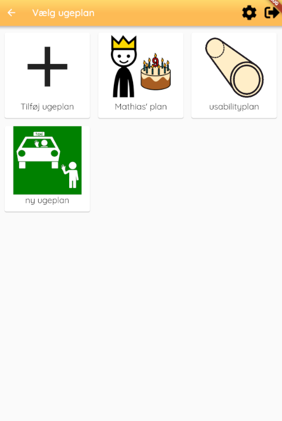

# weekplan_selector_screen.md

## Functionality
The weekplan selector screen is used to select one of the possible weekplans for a chosen citizen or to make a new weekplan. 

## Layout
An example of the the screen's layout can be seen here:

## Buttons
Pressing one of the weekplans displayed on the screen opens the pressed weekplan, if the "Tilføj ugeplan" button is pressed a new screen is shown where the user can make a new weekplan.

## Code
The build function return a scaffold which contains a column, the column uses a StreamBuilder to have the stream *_weekBloc.weekModels* output the different weekplans. 

If the data contained in the stream is different from null a gridview is used to display the weekplans, either three or four plans horizontally. The number of horizontally placed plans depend on if the device is in landscape or portrait mode. To help build the screen the function *_buildWeekPlanSelector* is called. This function distributes the responsibility of building the already created weekplans and building the button for creating a new weekplan. This functionality is shared between *_buildWeekPlan* and *_buildWeekPlanAdder*, where *_buildWeekPlan* is responsible for the "Tilføj ugeplan" button and *_buildWeekPlanAdder* is responsible for building the created weekplans.

