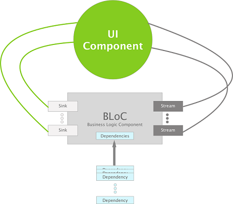
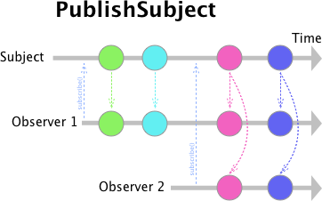
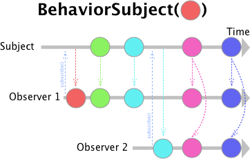
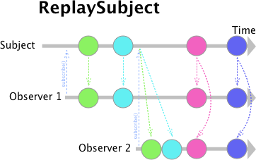

# BLoC Pattern
When we moved the weekplanner application to Flutter, we chose to structure the code with the BLoC pattern.

The name BLoC is used for two things, the BLoC pattern and classes called BLoC. To avoid confusion we always write BLoC pattern when we refer to the pattern. In all other cases we refer to the classes.

The BLoC pattern is a pattern that aims to isolate all business logic from UI code in order to be able to re-use the business logic [6]. The business logic has to be platform independent, meaning usable on both the web-application and the mobile-application without any modifications [6].

## What is BLoC
To understand the BLoC pattern one first needs to understand what a BLoC is. A BLoC is a simple class that only takes sinks as input and exposes streams as output [6]. All business logic should be inside a BLoC. The intuition is that BLoCs are the building blocks of the application [6]. Another key requirement of a BLoC is that all dependencies should be injected [6], so if an API is needed it should be injected in the constructor of the BLoC. This allows the web-platform to use a JSON-API and the mobile-platform to use a BINARY-API and other similar situations, while all platforms still uses the same BLoC without any modifications. An application thereby consist of many BLoC with different responsibilities. The BLoC can then be used by the UI components of all platforms.

### Sinks and streams
A BLoC can only communicate via sinks or streams. Both sinks and streams work as streams, but a sink is an input stream while a stream is for outputs.

A stream is an asynchronous sequence of data, similar to an asynchronous Iterable, but instead of the subscriber requesting the next item, the stream will emit as soon as a new item is ready [1]. This means that a BLoC receives data from the UI via a sink and emits data via the stream, both asynchronous. Both the UI component and the BLoC will react instantaneously whenever new data is received.

This uncovers a requirement of the UI component, which is state management. The UI should not be required to rely on state building, since the BLoC streams are asynchronous, which is why the UI components has to be able to handle streams [6].

## Rules of BLoC Pattern

An illustration of the BLoC pattern.

The BLoC pattern can be boiled down to some rules and one practice. The practice is that the business and UI logic should be clearly separated, with all the business logic inside a specific BLoC. An application should have multiple BLoCs. The decision of how to divide the business logic into multiple BLoCs is a judgment call. When a component is complex enough it should have its own BLoC [6]. The rules of the BLoC pattern are as follows: [6].

There are some rules for the design of BLoC that has to be upheld when the BLoC pattern is used:
- The first rule states that any communication between the UI and a BLoC must be through Sinks and Streams, so when the UI should send data to the BLoC it should use a sink, and when a BLoC sends data to the UI it should use a stream.
- The second rule states that all dependencies of a BLoC must be injectable; this is crucial for platform independence since it makes it possible to inject the correct dependencies for each platforms.
- The third rule states that it is not allowed to branch depending on the platform, meaning the business logic should be completely independent of the platform. What the rule is effectively stating is that inside a BLoC there should not be e.g. an if-statement checking if the platform is iOS and do some computation on behalf of that.
- The last rule states that the BLoC pattern can be implemented however the developer finds appropriate, as long as the other rules are upheld. Therefore the pattern is flexible and can be used in many different cases.

The following rules should be followed during the design of the UI:
- The first rule states that if the UI component is complex enough it should have its own BLoC, thereby also stating that UI components should share BLoC if they are non-complex.
- The second rule states that if the UI needs to send data to the BLoC, i.e. User inputs, the UI component is not allowed to do any computation on the inputs before sending it to the BLoC; this is a step to ensure decoupling between the UI and Business logic.
- The third rule is much like the second but concerns output instead of input. The output from a BLoC should not be changed inside the UI component, this again is to ensure that all business logic stays inside the BLoC.
- The fourth rule states that all business logic dependent if-statements inside the UI component should only depend on one boolean stream from the BLoC, this again is to decouple the UI component from the business logic, since branching on business logic in the UI most likely would hard couple UI and business logic.

## BLoC Implementation in the Giraf Project
The Flutter framework is not opinionated towards which architecture should be used so we had to decide for ourselves. We chose the BLoC pattern after considering other patterns like MVVM and MVC. In order to compare the different patterns, we made some goals we wanted the pattern to fulfill. This enabled us to compare the different patterns to each other and find the one that fit our needs the best. The goals were:

* Business logic should be re-usable by all widgets
* There should be a clear separation between UI and business logic.
* UI components should be reactive, i.e. if data changes in one component then the change should automatically be reflected in all other components relying on the same data.
* The pattern should allow for an intuitive file structure.

Doing some empirical experiments in building with the different patterns and reading different developers experience with the different patterns we came to the conclusion that the BLoC pattern offered the most freedom while still isolating the business logic and UI logic. The BLoC pattern also allow for all the other goals.

## BLoC Design Guidelines for the Giraf Project
The Giraf Project have altered the rules of the BLoC pattern a bit. The reason for this is that in the Giraf Project we are not using the code on other platforms than the Flutter Framework. Therefore to make the use of BLoC a bit more intuitive and flexible for the developers, we have constructed the following design guideline:

* Rather many small non-complex BLoCs than few large complex BLoCs
* Start by creating a BLoC per UI Screen, then after implementing the functionality consider to refactor to shared BLoC
* Inputs to BLoCs should be either Sinks or function calls with parameters
* BLoCs should be instantiated via the dependency injector/ Thereby all dependencies should also be injectable
* BLoCs are to be implemented using the rxDart library

We found that rxDart was a favourite library for BLoC implementation. In our experience it can be a good idea to follow the community since there exists many great resources on how to use it, and popular libraries are less likely to be abandoned.

## rxDart
"RxDart is a reactive functional programming library for Google Dart, based on ReactiveX." [5]. The Dart Language has a decent stream support, rxDart uses this to add the ReactiveX functionality on top of the native stream API [5]. To better understand how it helps in implementing the BLoC pattern we will provide a short explanation of what ReactiveX is, and describe the key features from the rxDart library that are used in the Giraf Project.

ReactiveX is a library in which one can use observable sequences to create asynchronous and event-based programs, "It extends the observer pattern to support sequences of data and/or events and adds operators that allow you to compose sequences together declaratively while abstracting away concerns about things like low-level threading, synchronization, thread-safety, concurrent data structures, and non-blocking I/O." [7].

The main features used from the rxDart library are three different stream behaviours, which are PublishSubject, BehaviorSubject and ReplaySubject. With these three stream behaviours, or subjects as rxDart refers to them, it is possible to implement any desired functionality.

### PublishSubject

An illustration of the behavior of a PublishSubject

The PublishSubject behaves like the Dart language's native StreamController, but with one exception, which is; a PublishSubject returns an Observable, where a StreamController returns a stream [3]. This means that the PublishSubject upholds the ReactiveX Subject contract and there by allow for all the ReactiveX operations [3]. The behaviour of a PublishSubject across time is shown in the above figure.

### BehaviorSubject

An illustration of the behavior of a BehaviorSubject

The BehaviorSubject behaves similar to the PublishSubject, but with one exception, it captures the latest item that has been added to the subject and emits that as the first item every time a new observer subscribes [2]. The BehaviorSubject can also be seeded with an initial item, that will be the first item emitted in case no items have been added to the subject yet. The behaviour of a BehaviorSubject across time is shown in the above figure.

### ReplaySubject

An illustration of the behavior of a ReplaySubject

The ReplaySubject behaves similar to the BehaviorSubject, but instead of only capturing the latest item, it captures all items and emits them whenever a new observer subscribes [4]. Unlike the BehaviorSubject, the ReplaySubject can not be seeded with an initial value. The behaviour of a ReplaySubject across time is shown in the above figure.
 
## Bibliography
1. Asynchronous Programming: Streams. Dart Lang. URL: https://www.dartlang.org/tutorials/language/streams
2. BehaviorSubject<T> class. rxDart Package. URL: https://pub.dartlang.org/documentation/rxdart/latest/rx/BehaviorSubject-class.html
3. PublishSubject<T> class. rxDart Package. URL: https://pub.dartlang.org/documentation/rxdart/latest/rx/PublishSubject-class.html
4. ReplaySubject<T> class. rxDart Package. URL: https://pub.dartlang.org/documentation/rxdart/latest/rx/ReplaySubject-class.html
5. RxDart Github Repository. ReactiveX. URL: https://github.com/ReactiveX/rxdart
6. Paolo Soares. Flutter / AngularDart – Code sharing, better together (DartConf 2018). Google Developers. 2018. URL: https://www.youtube.com/watch?v=PLHln7wHgPE.
7. The ReactiveX website. 2019. URL: http://reactivex.io/
